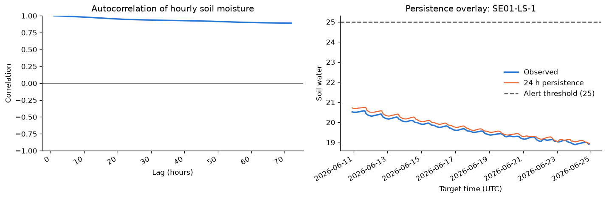
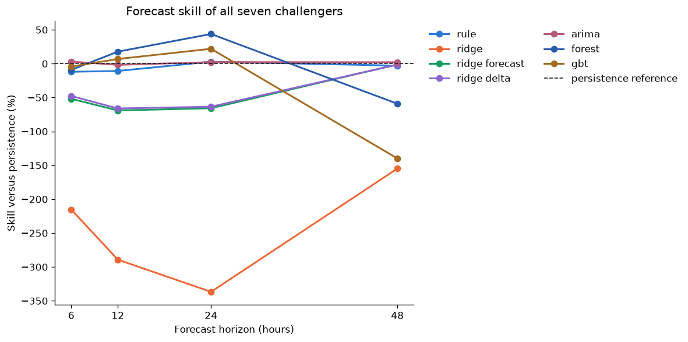
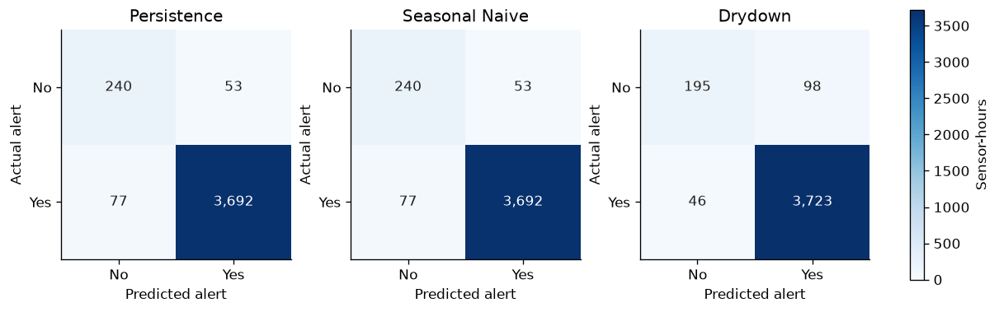

# Irrigation results

Rendered from `notebooks/01_irrigation_results.ipynb`. The committed notebook carries no
outputs; this page is the executed view. Regenerate with `uv run python scripts/render_notebooks.py`.

## Irrigation forecasting: why persistence ships

**Decision.** For the available Iron Horse Vineyard sensor history, the safest 6 to 48 hour soil-moisture forecast is the last observed value. This notebook reproduces a frozen seven-family benchmark end to end; nine further families were evaluated after it under the same protocol and are summarized in section 3b. Sixteen in total, and none of them changed what gets served.

This notebook tells that result from the pinned DVC sensor snapshot through forecast skill and irrigation-alert behavior. It is deliberately offline and calls VINE package APIs rather than rebuilding the pipeline or models here.

## Reproduction contract

1. From the repository root, materialize the pinned inputs once with `uv run dvc pull data/raw/sensors.dvc data/raw/weather.dvc`.
2. Restart the kernel and run all cells. No cell contacts InfluxDB, Open-Meteo, MLflow, or any other network service.
3. The frozen benchmark manifest is `configs/d2_irrigation/notebook_benchmark.yaml`; its seed, devices, horizons, folds, threshold, and seven challenger configs are the source of truth.

The DVC files pin the data version while `vine.d2_irrigation.data`, `vine.d2_irrigation.benchmark`, and the D5 evaluation APIs provide the executable analysis.

```python
from pathlib import Path

import matplotlib.pyplot as plt
import numpy as np
import pandas as pd

from vine.common import seed_everything
from vine.d2_irrigation import baselines
from vine.d2_irrigation.benchmark import load_benchmark_spec, run_benchmark
from vine.d2_irrigation.data import load_soil_probe_frames
from vine.d5_evaluation.metrics import binary_classification_metrics
from vine.d5_evaluation.walkforward import expanding_splits, purged_train_slice

ROOT = Path.cwd()
CONFIG = ROOT / "configs/d2_irrigation/notebook_benchmark.yaml"
COLORS = ["#2a78d6", "#eb6834", "#149e60", "#8e63ce", "#b65775", "#285bac", "#a46a21"]

spec = load_benchmark_spec(CONFIG)
seed_everything(spec.seed)
frames = load_soil_probe_frames()
required_devices = {spec.device, *spec.alert_devices}
missing = required_devices.difference(frames)
assert not missing, f"DVC snapshot is missing required probes: {sorted(missing)}"

plt.rcParams.update({"figure.dpi": 120, "axes.spines.top": False, "axes.spines.right": False})
```

## 1. What data do we actually have?

The snapshot contains hourly feature frames derived from raw probe readings. Missingness is reported, not silently imputed. The benchmark probe is used for the seven-family forecast comparison; three additional probes are reserved here to check whether threshold-alert behavior generalizes beyond one series.

```python
overview_rows = []
for device, frame in frames.items():
    moisture = frame["soil_water"]
    overview_rows.append(
        {
            "device": device,
            "start_utc": frame.index.min(),
            "end_utc": frame.index.max(),
            "hourly_rows": len(frame),
            "observed_moisture": int(moisture.notna().sum()),
            "missing_pct": 100 * moisture.isna().mean(),
            "mean": moisture.mean(),
            "min": moisture.min(),
            "max": moisture.max(),
            "below_threshold_pct": 100 * moisture.lt(spec.irrigate_below).mean(),
        }
    )

overview = pd.DataFrame(overview_rows).set_index("device")
overview.style.format(
    {
        "missing_pct": "{:.1f}%",
        "mean": "{:.2f}",
        "min": "{:.2f}",
        "max": "{:.2f}",
        "below_threshold_pct": "{:.1f}%",
    }
)
```

<style type="text/css">
</style>
<table id="T_e17e0">
  <thead>
    <tr>
      <th class="blank level0" >&nbsp;</th>
      <th id="T_e17e0_level0_col0" class="col_heading level0 col0" >start_utc</th>
      <th id="T_e17e0_level0_col1" class="col_heading level0 col1" >end_utc</th>
      <th id="T_e17e0_level0_col2" class="col_heading level0 col2" >hourly_rows</th>
      <th id="T_e17e0_level0_col3" class="col_heading level0 col3" >observed_moisture</th>
      <th id="T_e17e0_level0_col4" class="col_heading level0 col4" >missing_pct</th>
      <th id="T_e17e0_level0_col5" class="col_heading level0 col5" >mean</th>
      <th id="T_e17e0_level0_col6" class="col_heading level0 col6" >min</th>
      <th id="T_e17e0_level0_col7" class="col_heading level0 col7" >max</th>
      <th id="T_e17e0_level0_col8" class="col_heading level0 col8" >below_threshold_pct</th>
    </tr>
    <tr>
      <th class="index_name level0" >device</th>
      <th class="blank col0" >&nbsp;</th>
      <th class="blank col1" >&nbsp;</th>
      <th class="blank col2" >&nbsp;</th>
      <th class="blank col3" >&nbsp;</th>
      <th class="blank col4" >&nbsp;</th>
      <th class="blank col5" >&nbsp;</th>
      <th class="blank col6" >&nbsp;</th>
      <th class="blank col7" >&nbsp;</th>
      <th class="blank col8" >&nbsp;</th>
    </tr>
  </thead>
  <tbody>
    <tr>
      <th id="T_e17e0_level0_row0" class="row_heading level0 row0" >SE01-LS-1</th>
      <td id="T_e17e0_row0_col0" class="data row0 col0" >2026-01-22 00:00:00+00:00</td>
      <td id="T_e17e0_row0_col1" class="data row0 col1" >2026-07-08 17:00:00+00:00</td>
      <td id="T_e17e0_row0_col2" class="data row0 col2" >4026</td>
      <td id="T_e17e0_row0_col3" class="data row0 col3" >3401</td>
      <td id="T_e17e0_row0_col4" class="data row0 col4" >15.5%</td>
      <td id="T_e17e0_row0_col5" class="data row0 col5" >27.58</td>
      <td id="T_e17e0_row0_col6" class="data row0 col6" >17.99</td>
      <td id="T_e17e0_row0_col7" class="data row0 col7" >44.74</td>
      <td id="T_e17e0_row0_col8" class="data row0 col8" >30.9%</td>
    </tr>
    <tr>
      <th id="T_e17e0_level0_row1" class="row_heading level0 row1" >SE01-LS-2</th>
      <td id="T_e17e0_row1_col0" class="data row1 col0" >2026-01-22 00:00:00+00:00</td>
      <td id="T_e17e0_row1_col1" class="data row1 col1" >2026-07-08 17:00:00+00:00</td>
      <td id="T_e17e0_row1_col2" class="data row1 col2" >4026</td>
      <td id="T_e17e0_row1_col3" class="data row1 col3" >3401</td>
      <td id="T_e17e0_row1_col4" class="data row1 col4" >15.5%</td>
      <td id="T_e17e0_row1_col5" class="data row1 col5" >21.32</td>
      <td id="T_e17e0_row1_col6" class="data row1 col6" >15.44</td>
      <td id="T_e17e0_row1_col7" class="data row1 col7" >44.84</td>
      <td id="T_e17e0_row1_col8" class="data row1 col8" >74.9%</td>
    </tr>
    <tr>
      <th id="T_e17e0_level0_row2" class="row_heading level0 row2" >SE01-LS-3</th>
      <td id="T_e17e0_row2_col0" class="data row2 col0" >2026-01-22 00:00:00+00:00</td>
      <td id="T_e17e0_row2_col1" class="data row2 col1" >2026-07-08 17:00:00+00:00</td>
      <td id="T_e17e0_row2_col2" class="data row2 col2" >4026</td>
      <td id="T_e17e0_row2_col3" class="data row2 col3" >3401</td>
      <td id="T_e17e0_row2_col4" class="data row2 col4" >15.5%</td>
      <td id="T_e17e0_row2_col5" class="data row2 col5" >17.76</td>
      <td id="T_e17e0_row2_col6" class="data row2 col6" >10.30</td>
      <td id="T_e17e0_row2_col7" class="data row2 col7" >28.48</td>
      <td id="T_e17e0_row2_col8" class="data row2 col8" >83.4%</td>
    </tr>
    <tr>
      <th id="T_e17e0_level0_row3" class="row_heading level0 row3" >SE01-LS-4</th>
      <td id="T_e17e0_row3_col0" class="data row3 col0" >2026-01-22 00:00:00+00:00</td>
      <td id="T_e17e0_row3_col1" class="data row3 col1" >2026-07-08 17:00:00+00:00</td>
      <td id="T_e17e0_row3_col2" class="data row3 col2" >4026</td>
      <td id="T_e17e0_row3_col3" class="data row3 col3" >3401</td>
      <td id="T_e17e0_row3_col4" class="data row3 col4" >15.5%</td>
      <td id="T_e17e0_row3_col5" class="data row3 col5" >23.28</td>
      <td id="T_e17e0_row3_col6" class="data row3 col6" >17.25</td>
      <td id="T_e17e0_row3_col7" class="data row3 col7" >41.44</td>
      <td id="T_e17e0_row3_col8" class="data row3 col8" >68.6%</td>
    </tr>
    <tr>
      <th id="T_e17e0_level0_row4" class="row_heading level0 row4" >SE0X-LS-1</th>
      <td id="T_e17e0_row4_col0" class="data row4 col0" >2026-01-22 00:00:00+00:00</td>
      <td id="T_e17e0_row4_col1" class="data row4 col1" >2026-07-08 17:00:00+00:00</td>
      <td id="T_e17e0_row4_col2" class="data row4 col2" >4026</td>
      <td id="T_e17e0_row4_col3" class="data row4 col3" >3402</td>
      <td id="T_e17e0_row4_col4" class="data row4 col4" >15.5%</td>
      <td id="T_e17e0_row4_col5" class="data row4 col5" >18.92</td>
      <td id="T_e17e0_row4_col6" class="data row4 col6" >11.81</td>
      <td id="T_e17e0_row4_col7" class="data row4 col7" >60.46</td>
      <td id="T_e17e0_row4_col8" class="data row4 col8" >81.7%</td>
    </tr>
  </tbody>
</table>

## 2. The central signal: soil moisture is highly persistent

A strong autocorrelation is not merely descriptive: it explains why the correct floor is a persistence forecast, not a global mean. The left panel measures correlation with earlier observations. The right panel makes the 24-hour forecast concrete: at each target hour, persistence predicts the value observed one day earlier.

The overlay is restricted to a recent window for legibility. Gaps remain gaps; lines are not filled across missing readings.

```python
target = frames[spec.device]["soil_water"]
lags = np.arange(1, 73)
autocorrelation = pd.Series(
    [target.autocorr(lag=int(lag)) for lag in lags], index=lags, name="autocorrelation"
)

h_overlay = 24
persistence_24h = baselines.naive_persistence(target, h_overlay)
overlay = pd.concat(
    [target.rename("observed"), persistence_24h.rename("24 h persistence")], axis=1
).dropna()
overlay = overlay.loc[overlay.index.max() - pd.Timedelta(days=14) :]

fig, axes = plt.subplots(1, 2, figsize=(12, 4))
axes[0].plot(autocorrelation.index, autocorrelation, color=COLORS[0], linewidth=2)
axes[0].axhline(0, color="#777777", linewidth=0.8)
axes[0].set(
    title="Autocorrelation of hourly soil moisture", xlabel="Lag (hours)", ylabel="Correlation"
)
axes[0].set_ylim(-1, 1)

axes[1].plot(overlay.index, overlay["observed"], label="Observed", color=COLORS[0], linewidth=2)
axes[1].plot(
    overlay.index,
    overlay["24 h persistence"],
    label="24 h persistence",
    color=COLORS[1],
    linewidth=1.5,
)
axes[1].axhline(
    spec.irrigate_below,
    label=f"Alert threshold ({spec.irrigate_below:g})",
    color="#555555",
    linestyle="--",
)
axes[1].set(
    title=f"Persistence overlay: {spec.device}", xlabel="Target time (UTC)", ylabel="Soil water"
)
axes[1].legend(frameon=False)
fig.autofmt_xdate()
fig.tight_layout()
plt.show()
```



## 3. Frozen seven-family benchmark

The manifest declares seven challenger families: a recent-drydown rule, ridge, ridge with forecast-weather features, ridge on moisture change, ARIMA, random forest, and gradient-boosted trees. `run_benchmark` resolves each declared experiment config and delegates fitting and walk-forward scoring to the package.

**Reading skill:** `0` ties persistence; positive values improve on it; negative values are worse. Each challenger is scored against `matched_persistence_mae` on that challenger's exact non-missing rows, so models with different valid-row policies are not compared against an unrelated baseline denominator. Aggregate skill alone is not a ship gate. `skill_fold_min` exposes a model that wins on average by relying on one unusually easy interval but fails badly elsewhere.

```python
benchmark = run_benchmark(frames[spec.device], spec)

columns = [
    "family",
    "model",
    "horizon_h",
    "n",
    "mae",
    "matched_persistence_mae",
    "rmse",
    "skill_vs_persistence",
    "skill_fold_median",
    "skill_fold_min",
    "precision",
    "recall",
]
skill_table = benchmark.loc[:, columns].copy()
skill_table.style.format(
    {
        "mae": "{:.3f}",
        "matched_persistence_mae": "{:.3f}",
        "rmse": "{:.3f}",
        "skill_vs_persistence": "{:+.1%}",
        "skill_fold_median": "{:+.1%}",
        "skill_fold_min": "{:+.1%}",
        "precision": "{:.3f}",
        "recall": "{:.3f}",
    }
).background_gradient(subset=["skill_vs_persistence"], cmap="RdYlBu", vmin=-1, vmax=1)
```

```
2026-08-05T22:57:45.849503Z [info     ] evaluated horizon              horizon_h=6 models=['persistence', 'drydown', 'seasonal_naive', 'diurnal_drift', 'climatology', 'diurnal_drift_temp'] n=1367
```

```
2026-08-05T22:57:45.863794Z [info     ] evaluated horizon              horizon_h=12 models=['persistence', 'drydown', 'seasonal_naive', 'diurnal_drift', 'climatology', 'diurnal_drift_temp'] n=1361
```

```
2026-08-05T22:57:45.877266Z [info     ] evaluated horizon              horizon_h=24 models=['persistence', 'drydown', 'seasonal_naive', 'diurnal_drift', 'climatology', 'diurnal_drift_temp'] n=1354
```

```
2026-08-05T22:57:45.890606Z [info     ] evaluated horizon              horizon_h=48 models=['persistence', 'drydown', 'seasonal_naive', 'diurnal_drift', 'climatology', 'diurnal_drift_temp'] n=1335
```

```
2026-08-05T22:57:46.626251Z [info     ] evaluated horizon              horizon_h=6 models=['persistence', 'drydown', 'seasonal_naive', 'diurnal_drift', 'climatology', 'diurnal_drift_temp', 'ridge'] n=1361
```

```
2026-08-05T22:57:46.651595Z [info     ] evaluated horizon              horizon_h=12 models=['persistence', 'drydown', 'seasonal_naive', 'diurnal_drift', 'climatology', 'diurnal_drift_temp', 'ridge'] n=1355
```

```
2026-08-05T22:57:46.675742Z [info     ] evaluated horizon              horizon_h=24 models=['persistence', 'drydown', 'seasonal_naive', 'diurnal_drift', 'climatology', 'diurnal_drift_temp', 'ridge'] n=1348
```

```
2026-08-05T22:57:46.699761Z [info     ] evaluated horizon              horizon_h=48 models=['persistence', 'drydown', 'seasonal_naive', 'diurnal_drift', 'climatology', 'diurnal_drift_temp', 'ridge'] n=1329
```

```
2026-08-05T22:57:46.730208Z [info     ] evaluated horizon              horizon_h=6 models=['persistence', 'drydown', 'seasonal_naive', 'diurnal_drift', 'climatology', 'diurnal_drift_temp', 'ridge'] n=1361
```

```
2026-08-05T22:57:46.754838Z [info     ] evaluated horizon              horizon_h=12 models=['persistence', 'drydown', 'seasonal_naive', 'diurnal_drift', 'climatology', 'diurnal_drift_temp', 'ridge'] n=1355
```

```
2026-08-05T22:57:46.779757Z [info     ] evaluated horizon              horizon_h=24 models=['persistence', 'drydown', 'seasonal_naive', 'diurnal_drift', 'climatology', 'diurnal_drift_temp', 'ridge'] n=1348
```

```
2026-08-05T22:57:46.804327Z [info     ] evaluated horizon              horizon_h=48 models=['persistence', 'drydown', 'seasonal_naive', 'diurnal_drift', 'climatology', 'diurnal_drift_temp', 'ridge'] n=1329
```

```
2026-08-05T22:57:46.832210Z [info     ] evaluated horizon              horizon_h=6 models=['persistence', 'drydown', 'seasonal_naive', 'diurnal_drift', 'climatology', 'diurnal_drift_temp', 'ridge_delta'] n=1361
```

```
2026-08-05T22:57:46.858329Z [info     ] evaluated horizon              horizon_h=12 models=['persistence', 'drydown', 'seasonal_naive', 'diurnal_drift', 'climatology', 'diurnal_drift_temp', 'ridge_delta'] n=1355
```

```
2026-08-05T22:57:46.883979Z [info     ] evaluated horizon              horizon_h=24 models=['persistence', 'drydown', 'seasonal_naive', 'diurnal_drift', 'climatology', 'diurnal_drift_temp', 'ridge_delta'] n=1348
```

```
2026-08-05T22:57:46.910232Z [info     ] evaluated horizon              horizon_h=48 models=['persistence', 'drydown', 'seasonal_naive', 'diurnal_drift', 'climatology', 'diurnal_drift_temp', 'ridge_delta'] n=1329
```

```
2026-08-05T22:57:48.764351Z [info     ] evaluated horizon              horizon_h=6 models=['persistence', 'drydown', 'seasonal_naive', 'diurnal_drift', 'climatology', 'diurnal_drift_temp', 'arima'] n=1367
```

```
2026-08-05T22:57:50.555952Z [info     ] evaluated horizon              horizon_h=12 models=['persistence', 'drydown', 'seasonal_naive', 'diurnal_drift', 'climatology', 'diurnal_drift_temp', 'arima'] n=1361
```

```
2026-08-05T22:57:52.500153Z [info     ] evaluated horizon              horizon_h=24 models=['persistence', 'drydown', 'seasonal_naive', 'diurnal_drift', 'climatology', 'diurnal_drift_temp', 'arima'] n=1354
```

```
2026-08-05T22:57:54.583553Z [info     ] evaluated horizon              horizon_h=48 models=['persistence', 'drydown', 'seasonal_naive', 'diurnal_drift', 'climatology', 'diurnal_drift_temp', 'arima'] n=1335
```

```
2026-08-05T22:57:57.969450Z [info     ] evaluated horizon              horizon_h=6 models=['persistence', 'drydown', 'seasonal_naive', 'diurnal_drift', 'climatology', 'diurnal_drift_temp', 'forest_delta'] n=1361
```

```
2026-08-05T22:58:01.089049Z [info     ] evaluated horizon              horizon_h=12 models=['persistence', 'drydown', 'seasonal_naive', 'diurnal_drift', 'climatology', 'diurnal_drift_temp', 'forest_delta'] n=1355
```

```
2026-08-05T22:58:04.610452Z [info     ] evaluated horizon              horizon_h=24 models=['persistence', 'drydown', 'seasonal_naive', 'diurnal_drift', 'climatology', 'diurnal_drift_temp', 'forest_delta'] n=1348
```

```
2026-08-05T22:58:07.614522Z [info     ] evaluated horizon              horizon_h=48 models=['persistence', 'drydown', 'seasonal_naive', 'diurnal_drift', 'climatology', 'diurnal_drift_temp', 'forest_delta'] n=1329
```

```
2026-08-05T22:58:24.498809Z [info     ] evaluated horizon              horizon_h=6 models=['persistence', 'drydown', 'seasonal_naive', 'diurnal_drift', 'climatology', 'diurnal_drift_temp', 'gbt_delta'] n=1367
```

```
2026-08-05T22:58:41.659596Z [info     ] evaluated horizon              horizon_h=12 models=['persistence', 'drydown', 'seasonal_naive', 'diurnal_drift', 'climatology', 'diurnal_drift_temp', 'gbt_delta'] n=1361
```

```
2026-08-05T22:58:58.603430Z [info     ] evaluated horizon              horizon_h=24 models=['persistence', 'drydown', 'seasonal_naive', 'diurnal_drift', 'climatology', 'diurnal_drift_temp', 'gbt_delta'] n=1354
```

```
2026-08-05T22:59:16.069760Z [info     ] evaluated horizon              horizon_h=48 models=['persistence', 'drydown', 'seasonal_naive', 'diurnal_drift', 'climatology', 'diurnal_drift_temp', 'gbt_delta'] n=1335
```

<style type="text/css">
#T_8017b_row0_col7, #T_8017b_row22_col7 {
  background-color: #fbfdc7;
  color: #000000;
}
#T_8017b_row1_col7, #T_8017b_row12_col7, #T_8017b_row24_col7, #T_8017b_row25_col7, #T_8017b_row31_col7, #T_8017b_row32_col7 {
  background-color: #feffc0;
  color: #000000;
}
#T_8017b_row2_col7 {
  background-color: #fff8b5;
  color: #000000;
}
#T_8017b_row3_col7 {
  background-color: #fff1aa;
  color: #000000;
}
#T_8017b_row4_col7 {
  background-color: #feeca2;
  color: #000000;
}
#T_8017b_row5_col7 {
  background-color: #f99355;
  color: #000000;
}
#T_8017b_row6_col7 {
  background-color: #f8864f;
  color: #f1f1f1;
}
#T_8017b_row7_col7, #T_8017b_row8_col7, #T_8017b_row9_col7, #T_8017b_row18_col7, #T_8017b_row19_col7, #T_8017b_row28_col7, #T_8017b_row29_col7, #T_8017b_row37_col7, #T_8017b_row38_col7, #T_8017b_row39_col7 {
  background-color: #a50026;
  color: #f1f1f1;
}
#T_8017b_row10_col7 {
  background-color: #e4f4f1;
  color: #000000;
}
#T_8017b_row11_col7 {
  background-color: #f5fbd2;
  color: #000000;
}
#T_8017b_row13_col7 {
  background-color: #fffcba;
  color: #000000;
}
#T_8017b_row14_col7 {
  background-color: #feefa6;
  color: #000000;
}
#T_8017b_row15_col7 {
  background-color: #f46d43;
  color: #f1f1f1;
}
#T_8017b_row16_col7, #T_8017b_row27_col7 {
  background-color: #eb5a3a;
  color: #f1f1f1;
}
#T_8017b_row17_col7 {
  background-color: #e65036;
  color: #f1f1f1;
}
#T_8017b_row20_col7 {
  background-color: #9fd0e4;
  color: #000000;
}
#T_8017b_row21_col7 {
  background-color: #daf0f6;
  color: #000000;
}
#T_8017b_row23_col7, #T_8017b_row30_col7 {
  background-color: #fcfec5;
  color: #000000;
}
#T_8017b_row26_col7 {
  background-color: #ee613e;
  color: #f1f1f1;
}
#T_8017b_row33_col7, #T_8017b_row34_col7 {
  background-color: #fffdbc;
  color: #000000;
}
#T_8017b_row35_col7 {
  background-color: #fffbb9;
  color: #000000;
}
#T_8017b_row36_col7 {
  background-color: #f47044;
  color: #f1f1f1;
}
</style>
<table id="T_8017b">
  <thead>
    <tr>
      <th class="blank level0" >&nbsp;</th>
      <th id="T_8017b_level0_col0" class="col_heading level0 col0" >family</th>
      <th id="T_8017b_level0_col1" class="col_heading level0 col1" >model</th>
      <th id="T_8017b_level0_col2" class="col_heading level0 col2" >horizon_h</th>
      <th id="T_8017b_level0_col3" class="col_heading level0 col3" >n</th>
      <th id="T_8017b_level0_col4" class="col_heading level0 col4" >mae</th>
      <th id="T_8017b_level0_col5" class="col_heading level0 col5" >matched_persistence_mae</th>
      <th id="T_8017b_level0_col6" class="col_heading level0 col6" >rmse</th>
      <th id="T_8017b_level0_col7" class="col_heading level0 col7" >skill_vs_persistence</th>
      <th id="T_8017b_level0_col8" class="col_heading level0 col8" >skill_fold_median</th>
      <th id="T_8017b_level0_col9" class="col_heading level0 col9" >skill_fold_min</th>
      <th id="T_8017b_level0_col10" class="col_heading level0 col10" >precision</th>
      <th id="T_8017b_level0_col11" class="col_heading level0 col11" >recall</th>
    </tr>
  </thead>
  <tbody>
    <tr>
      <th id="T_8017b_level0_row0" class="row_heading level0 row0" >0</th>
      <td id="T_8017b_row0_col0" class="data row0 col0" >arima</td>
      <td id="T_8017b_row0_col1" class="data row0 col1" >arima</td>
      <td id="T_8017b_row0_col2" class="data row0 col2" >6</td>
      <td id="T_8017b_row0_col3" class="data row0 col3" >1367</td>
      <td id="T_8017b_row0_col4" class="data row0 col4" >0.102</td>
      <td id="T_8017b_row0_col5" class="data row0 col5" >0.105</td>
      <td id="T_8017b_row0_col6" class="data row0 col6" >0.283</td>
      <td id="T_8017b_row0_col7" class="data row0 col7" >+3.0%</td>
      <td id="T_8017b_row0_col8" class="data row0 col8" >+2.6%</td>
      <td id="T_8017b_row0_col9" class="data row0 col9" >-0.1%</td>
      <td id="T_8017b_row0_col10" class="data row0 col10" >1.000</td>
      <td id="T_8017b_row0_col11" class="data row0 col11" >1.000</td>
    </tr>
    <tr>
      <th id="T_8017b_level0_row1" class="row_heading level0 row1" >1</th>
      <td id="T_8017b_row1_col0" class="data row1 col0" >baseline</td>
      <td id="T_8017b_row1_col1" class="data row1 col1" >persistence</td>
      <td id="T_8017b_row1_col2" class="data row1 col2" >6</td>
      <td id="T_8017b_row1_col3" class="data row1 col3" >1367</td>
      <td id="T_8017b_row1_col4" class="data row1 col4" >0.105</td>
      <td id="T_8017b_row1_col5" class="data row1 col5" >0.105</td>
      <td id="T_8017b_row1_col6" class="data row1 col6" >0.287</td>
      <td id="T_8017b_row1_col7" class="data row1 col7" >+0.0%</td>
      <td id="T_8017b_row1_col8" class="data row1 col8" >+0.0%</td>
      <td id="T_8017b_row1_col9" class="data row1 col9" >+0.0%</td>
      <td id="T_8017b_row1_col10" class="data row1 col10" >1.000</td>
      <td id="T_8017b_row1_col11" class="data row1 col11" >1.000</td>
    </tr>
    <tr>
      <th id="T_8017b_level0_row2" class="row_heading level0 row2" >2</th>
      <td id="T_8017b_row2_col0" class="data row2 col0" >gbt</td>
      <td id="T_8017b_row2_col1" class="data row2 col1" >gbt_delta</td>
      <td id="T_8017b_row2_col2" class="data row2 col2" >6</td>
      <td id="T_8017b_row2_col3" class="data row2 col3" >1367</td>
      <td id="T_8017b_row2_col4" class="data row2 col4" >0.109</td>
      <td id="T_8017b_row2_col5" class="data row2 col5" >0.105</td>
      <td id="T_8017b_row2_col6" class="data row2 col6" >0.252</td>
      <td id="T_8017b_row2_col7" class="data row2 col7" >-4.2%</td>
      <td id="T_8017b_row2_col8" class="data row2 col8" >-4.8%</td>
      <td id="T_8017b_row2_col9" class="data row2 col9" >-32.2%</td>
      <td id="T_8017b_row2_col10" class="data row2 col10" >1.000</td>
      <td id="T_8017b_row2_col11" class="data row2 col11" >1.000</td>
    </tr>
    <tr>
      <th id="T_8017b_level0_row3" class="row_heading level0 row3" >3</th>
      <td id="T_8017b_row3_col0" class="data row3 col0" >forest</td>
      <td id="T_8017b_row3_col1" class="data row3 col1" >forest_delta</td>
      <td id="T_8017b_row3_col2" class="data row3 col2" >6</td>
      <td id="T_8017b_row3_col3" class="data row3 col3" >1361</td>
      <td id="T_8017b_row3_col4" class="data row3 col4" >0.115</td>
      <td id="T_8017b_row3_col5" class="data row3 col5" >0.105</td>
      <td id="T_8017b_row3_col6" class="data row3 col6" >0.282</td>
      <td id="T_8017b_row3_col7" class="data row3 col7" >-9.1%</td>
      <td id="T_8017b_row3_col8" class="data row3 col8" >-10.7%</td>
      <td id="T_8017b_row3_col9" class="data row3 col9" >-97.6%</td>
      <td id="T_8017b_row3_col10" class="data row3 col10" >1.000</td>
      <td id="T_8017b_row3_col11" class="data row3 col11" >1.000</td>
    </tr>
    <tr>
      <th id="T_8017b_level0_row4" class="row_heading level0 row4" >4</th>
      <td id="T_8017b_row4_col0" class="data row4 col0" >rule</td>
      <td id="T_8017b_row4_col1" class="data row4 col1" >drydown</td>
      <td id="T_8017b_row4_col2" class="data row4 col2" >6</td>
      <td id="T_8017b_row4_col3" class="data row4 col3" >1367</td>
      <td id="T_8017b_row4_col4" class="data row4 col4" >0.117</td>
      <td id="T_8017b_row4_col5" class="data row4 col5" >0.105</td>
      <td id="T_8017b_row4_col6" class="data row4 col6" >0.326</td>
      <td id="T_8017b_row4_col7" class="data row4 col7" >-12.0%</td>
      <td id="T_8017b_row4_col8" class="data row4 col8" >-9.7%</td>
      <td id="T_8017b_row4_col9" class="data row4 col9" >-16.6%</td>
      <td id="T_8017b_row4_col10" class="data row4 col10" >1.000</td>
      <td id="T_8017b_row4_col11" class="data row4 col11" >1.000</td>
    </tr>
    <tr>
      <th id="T_8017b_level0_row5" class="row_heading level0 row5" >5</th>
      <td id="T_8017b_row5_col0" class="data row5 col0" >ridge_delta</td>
      <td id="T_8017b_row5_col1" class="data row5 col1" >ridge_delta</td>
      <td id="T_8017b_row5_col2" class="data row5 col2" >6</td>
      <td id="T_8017b_row5_col3" class="data row5 col3" >1361</td>
      <td id="T_8017b_row5_col4" class="data row5 col4" >0.155</td>
      <td id="T_8017b_row5_col5" class="data row5 col5" >0.105</td>
      <td id="T_8017b_row5_col6" class="data row5 col6" >0.323</td>
      <td id="T_8017b_row5_col7" class="data row5 col7" >-47.7%</td>
      <td id="T_8017b_row5_col8" class="data row5 col8" >-53.7%</td>
      <td id="T_8017b_row5_col9" class="data row5 col9" >-137.0%</td>
      <td id="T_8017b_row5_col10" class="data row5 col10" >1.000</td>
      <td id="T_8017b_row5_col11" class="data row5 col11" >1.000</td>
    </tr>
    <tr>
      <th id="T_8017b_level0_row6" class="row_heading level0 row6" >6</th>
      <td id="T_8017b_row6_col0" class="data row6 col0" >ridge_forecast</td>
      <td id="T_8017b_row6_col1" class="data row6 col1" >ridge</td>
      <td id="T_8017b_row6_col2" class="data row6 col2" >6</td>
      <td id="T_8017b_row6_col3" class="data row6 col3" >1361</td>
      <td id="T_8017b_row6_col4" class="data row6 col4" >0.160</td>
      <td id="T_8017b_row6_col5" class="data row6 col5" >0.105</td>
      <td id="T_8017b_row6_col6" class="data row6 col6" >0.328</td>
      <td id="T_8017b_row6_col7" class="data row6 col7" >-51.9%</td>
      <td id="T_8017b_row6_col8" class="data row6 col8" >-58.3%</td>
      <td id="T_8017b_row6_col9" class="data row6 col9" >-139.1%</td>
      <td id="T_8017b_row6_col10" class="data row6 col10" >1.000</td>
      <td id="T_8017b_row6_col11" class="data row6 col11" >1.000</td>
    </tr>
    <tr>
      <th id="T_8017b_level0_row7" class="row_heading level0 row7" >7</th>
      <td id="T_8017b_row7_col0" class="data row7 col0" >baseline</td>
      <td id="T_8017b_row7_col1" class="data row7 col1" >seasonal_naive</td>
      <td id="T_8017b_row7_col2" class="data row7 col2" >6</td>
      <td id="T_8017b_row7_col3" class="data row7 col3" >1367</td>
      <td id="T_8017b_row7_col4" class="data row7 col4" >0.283</td>
      <td id="T_8017b_row7_col5" class="data row7 col5" >0.105</td>
      <td id="T_8017b_row7_col6" class="data row7 col6" >0.588</td>
      <td id="T_8017b_row7_col7" class="data row7 col7" >-170.1%</td>
      <td id="T_8017b_row7_col8" class="data row7 col8" >-104.5%</td>
      <td id="T_8017b_row7_col9" class="data row7 col9" >-203.4%</td>
      <td id="T_8017b_row7_col10" class="data row7 col10" >1.000</td>
      <td id="T_8017b_row7_col11" class="data row7 col11" >1.000</td>
    </tr>
    <tr>
      <th id="T_8017b_level0_row8" class="row_heading level0 row8" >8</th>
      <td id="T_8017b_row8_col0" class="data row8 col0" >ridge</td>
      <td id="T_8017b_row8_col1" class="data row8 col1" >ridge</td>
      <td id="T_8017b_row8_col2" class="data row8 col2" >6</td>
      <td id="T_8017b_row8_col3" class="data row8 col3" >1361</td>
      <td id="T_8017b_row8_col4" class="data row8 col4" >0.331</td>
      <td id="T_8017b_row8_col5" class="data row8 col5" >0.105</td>
      <td id="T_8017b_row8_col6" class="data row8 col6" >0.483</td>
      <td id="T_8017b_row8_col7" class="data row8 col7" >-215.3%</td>
      <td id="T_8017b_row8_col8" class="data row8 col8" >-146.2%</td>
      <td id="T_8017b_row8_col9" class="data row8 col9" >-531.1%</td>
      <td id="T_8017b_row8_col10" class="data row8 col10" >1.000</td>
      <td id="T_8017b_row8_col11" class="data row8 col11" >1.000</td>
    </tr>
    <tr>
      <th id="T_8017b_level0_row9" class="row_heading level0 row9" >9</th>
      <td id="T_8017b_row9_col0" class="data row9 col0" >baseline</td>
      <td id="T_8017b_row9_col1" class="data row9 col1" >climatology</td>
      <td id="T_8017b_row9_col2" class="data row9 col2" >6</td>
      <td id="T_8017b_row9_col3" class="data row9 col3" >1367</td>
      <td id="T_8017b_row9_col4" class="data row9 col4" >5.424</td>
      <td id="T_8017b_row9_col5" class="data row9 col5" >0.105</td>
      <td id="T_8017b_row9_col6" class="data row9 col6" >6.350</td>
      <td id="T_8017b_row9_col7" class="data row9 col7" >-5081.3%</td>
      <td id="T_8017b_row9_col8" class="data row9 col8" >-12953.1%</td>
      <td id="T_8017b_row9_col9" class="data row9 col9" >-15955.8%</td>
      <td id="T_8017b_row9_col10" class="data row9 col10" >0.000</td>
      <td id="T_8017b_row9_col11" class="data row9 col11" >0.000</td>
    </tr>
    <tr>
      <th id="T_8017b_level0_row10" class="row_heading level0 row10" >10</th>
      <td id="T_8017b_row10_col0" class="data row10 col0" >forest</td>
      <td id="T_8017b_row10_col1" class="data row10 col1" >forest_delta</td>
      <td id="T_8017b_row10_col2" class="data row10 col2" >12</td>
      <td id="T_8017b_row10_col3" class="data row10 col3" >1355</td>
      <td id="T_8017b_row10_col4" class="data row10 col4" >0.146</td>
      <td id="T_8017b_row10_col5" class="data row10 col5" >0.177</td>
      <td id="T_8017b_row10_col6" class="data row10 col6" >0.360</td>
      <td id="T_8017b_row10_col7" class="data row10 col7" >+17.7%</td>
      <td id="T_8017b_row10_col8" class="data row10 col8" >+20.7%</td>
      <td id="T_8017b_row10_col9" class="data row10 col9" >-44.5%</td>
      <td id="T_8017b_row10_col10" class="data row10 col10" >1.000</td>
      <td id="T_8017b_row10_col11" class="data row10 col11" >1.000</td>
    </tr>
    <tr>
      <th id="T_8017b_level0_row11" class="row_heading level0 row11" >11</th>
      <td id="T_8017b_row11_col0" class="data row11 col0" >gbt</td>
      <td id="T_8017b_row11_col1" class="data row11 col1" >gbt_delta</td>
      <td id="T_8017b_row11_col2" class="data row11 col2" >12</td>
      <td id="T_8017b_row11_col3" class="data row11 col3" >1361</td>
      <td id="T_8017b_row11_col4" class="data row11 col4" >0.165</td>
      <td id="T_8017b_row11_col5" class="data row11 col5" >0.177</td>
      <td id="T_8017b_row11_col6" class="data row11 col6" >0.350</td>
      <td id="T_8017b_row11_col7" class="data row11 col7" >+6.9%</td>
      <td id="T_8017b_row11_col8" class="data row11 col8" >+21.1%</td>
      <td id="T_8017b_row11_col9" class="data row11 col9" >-64.6%</td>
      <td id="T_8017b_row11_col10" class="data row11 col10" >1.000</td>
      <td id="T_8017b_row11_col11" class="data row11 col11" >1.000</td>
    </tr>
    <tr>
      <th id="T_8017b_level0_row12" class="row_heading level0 row12" >12</th>
      <td id="T_8017b_row12_col0" class="data row12 col0" >baseline</td>
      <td id="T_8017b_row12_col1" class="data row12 col1" >persistence</td>
      <td id="T_8017b_row12_col2" class="data row12 col2" >12</td>
      <td id="T_8017b_row12_col3" class="data row12 col3" >1361</td>
      <td id="T_8017b_row12_col4" class="data row12 col4" >0.177</td>
      <td id="T_8017b_row12_col5" class="data row12 col5" >0.177</td>
      <td id="T_8017b_row12_col6" class="data row12 col6" >0.428</td>
      <td id="T_8017b_row12_col7" class="data row12 col7" >+0.0%</td>
      <td id="T_8017b_row12_col8" class="data row12 col8" >+0.0%</td>
      <td id="T_8017b_row12_col9" class="data row12 col9" >+0.0%</td>
      <td id="T_8017b_row12_col10" class="data row12 col10" >1.000</td>
      <td id="T_8017b_row12_col11" class="data row12 col11" >1.000</td>
    </tr>
    <tr>
      <th id="T_8017b_level0_row13" class="row_heading level0 row13" >13</th>
      <td id="T_8017b_row13_col0" class="data row13 col0" >arima</td>
      <td id="T_8017b_row13_col1" class="data row13 col1" >arima</td>
      <td id="T_8017b_row13_col2" class="data row13 col2" >12</td>
      <td id="T_8017b_row13_col3" class="data row13 col3" >1361</td>
      <td id="T_8017b_row13_col4" class="data row13 col4" >0.180</td>
      <td id="T_8017b_row13_col5" class="data row13 col5" >0.177</td>
      <td id="T_8017b_row13_col6" class="data row13 col6" >0.433</td>
      <td id="T_8017b_row13_col7" class="data row13 col7" >-1.8%</td>
      <td id="T_8017b_row13_col8" class="data row13 col8" >-3.4%</td>
      <td id="T_8017b_row13_col9" class="data row13 col9" >-9.4%</td>
      <td id="T_8017b_row13_col10" class="data row13 col10" >1.000</td>
      <td id="T_8017b_row13_col11" class="data row13 col11" >1.000</td>
    </tr>
    <tr>
      <th id="T_8017b_level0_row14" class="row_heading level0 row14" >14</th>
      <td id="T_8017b_row14_col0" class="data row14 col0" >rule</td>
      <td id="T_8017b_row14_col1" class="data row14 col1" >drydown</td>
      <td id="T_8017b_row14_col2" class="data row14 col2" >12</td>
      <td id="T_8017b_row14_col3" class="data row14 col3" >1361</td>
      <td id="T_8017b_row14_col4" class="data row14 col4" >0.196</td>
      <td id="T_8017b_row14_col5" class="data row14 col5" >0.177</td>
      <td id="T_8017b_row14_col6" class="data row14 col6" >0.539</td>
      <td id="T_8017b_row14_col7" class="data row14 col7" >-10.8%</td>
      <td id="T_8017b_row14_col8" class="data row14 col8" >-4.1%</td>
      <td id="T_8017b_row14_col9" class="data row14 col9" >-30.6%</td>
      <td id="T_8017b_row14_col10" class="data row14 col10" >1.000</td>
      <td id="T_8017b_row14_col11" class="data row14 col11" >1.000</td>
    </tr>
    <tr>
      <th id="T_8017b_level0_row15" class="row_heading level0 row15" >15</th>
      <td id="T_8017b_row15_col0" class="data row15 col0" >baseline</td>
      <td id="T_8017b_row15_col1" class="data row15 col1" >seasonal_naive</td>
      <td id="T_8017b_row15_col2" class="data row15 col2" >12</td>
      <td id="T_8017b_row15_col3" class="data row15 col3" >1361</td>
      <td id="T_8017b_row15_col4" class="data row15 col4" >0.283</td>
      <td id="T_8017b_row15_col5" class="data row15 col5" >0.177</td>
      <td id="T_8017b_row15_col6" class="data row15 col6" >0.589</td>
      <td id="T_8017b_row15_col7" class="data row15 col7" >-59.9%</td>
      <td id="T_8017b_row15_col8" class="data row15 col8" >-33.4%</td>
      <td id="T_8017b_row15_col9" class="data row15 col9" >-69.9%</td>
      <td id="T_8017b_row15_col10" class="data row15 col10" >1.000</td>
      <td id="T_8017b_row15_col11" class="data row15 col11" >1.000</td>
    </tr>
    <tr>
      <th id="T_8017b_level0_row16" class="row_heading level0 row16" >16</th>
      <td id="T_8017b_row16_col0" class="data row16 col0" >ridge_delta</td>
      <td id="T_8017b_row16_col1" class="data row16 col1" >ridge_delta</td>
      <td id="T_8017b_row16_col2" class="data row16 col2" >12</td>
      <td id="T_8017b_row16_col3" class="data row16 col3" >1355</td>
      <td id="T_8017b_row16_col4" class="data row16 col4" >0.294</td>
      <td id="T_8017b_row16_col5" class="data row16 col5" >0.177</td>
      <td id="T_8017b_row16_col6" class="data row16 col6" >0.549</td>
      <td id="T_8017b_row16_col7" class="data row16 col7" >-66.1%</td>
      <td id="T_8017b_row16_col8" class="data row16 col8" >-70.1%</td>
      <td id="T_8017b_row16_col9" class="data row16 col9" >-164.9%</td>
      <td id="T_8017b_row16_col10" class="data row16 col10" >1.000</td>
      <td id="T_8017b_row16_col11" class="data row16 col11" >1.000</td>
    </tr>
    <tr>
      <th id="T_8017b_level0_row17" class="row_heading level0 row17" >17</th>
      <td id="T_8017b_row17_col0" class="data row17 col0" >ridge_forecast</td>
      <td id="T_8017b_row17_col1" class="data row17 col1" >ridge</td>
      <td id="T_8017b_row17_col2" class="data row17 col2" >12</td>
      <td id="T_8017b_row17_col3" class="data row17 col3" >1355</td>
      <td id="T_8017b_row17_col4" class="data row17 col4" >0.300</td>
      <td id="T_8017b_row17_col5" class="data row17 col5" >0.177</td>
      <td id="T_8017b_row17_col6" class="data row17 col6" >0.557</td>
      <td id="T_8017b_row17_col7" class="data row17 col7" >-69.0%</td>
      <td id="T_8017b_row17_col8" class="data row17 col8" >-74.1%</td>
      <td id="T_8017b_row17_col9" class="data row17 col9" >-166.3%</td>
      <td id="T_8017b_row17_col10" class="data row17 col10" >1.000</td>
      <td id="T_8017b_row17_col11" class="data row17 col11" >1.000</td>
    </tr>
    <tr>
      <th id="T_8017b_level0_row18" class="row_heading level0 row18" >18</th>
      <td id="T_8017b_row18_col0" class="data row18 col0" >ridge</td>
      <td id="T_8017b_row18_col1" class="data row18 col1" >ridge</td>
      <td id="T_8017b_row18_col2" class="data row18 col2" >12</td>
      <td id="T_8017b_row18_col3" class="data row18 col3" >1355</td>
      <td id="T_8017b_row18_col4" class="data row18 col4" >0.690</td>
      <td id="T_8017b_row18_col5" class="data row18 col5" >0.177</td>
      <td id="T_8017b_row18_col6" class="data row18 col6" >0.936</td>
      <td id="T_8017b_row18_col7" class="data row18 col7" >-289.2%</td>
      <td id="T_8017b_row18_col8" class="data row18 col8" >-232.1%</td>
      <td id="T_8017b_row18_col9" class="data row18 col9" >-874.7%</td>
      <td id="T_8017b_row18_col10" class="data row18 col10" >1.000</td>
      <td id="T_8017b_row18_col11" class="data row18 col11" >1.000</td>
    </tr>
    <tr>
      <th id="T_8017b_level0_row19" class="row_heading level0 row19" >19</th>
      <td id="T_8017b_row19_col0" class="data row19 col0" >baseline</td>
      <td id="T_8017b_row19_col1" class="data row19 col1" >climatology</td>
      <td id="T_8017b_row19_col2" class="data row19 col2" >12</td>
      <td id="T_8017b_row19_col3" class="data row19 col3" >1361</td>
      <td id="T_8017b_row19_col4" class="data row19 col4" >5.424</td>
      <td id="T_8017b_row19_col5" class="data row19 col5" >0.177</td>
      <td id="T_8017b_row19_col6" class="data row19 col6" >6.356</td>
      <td id="T_8017b_row19_col7" class="data row19 col7" >-2967.7%</td>
      <td id="T_8017b_row19_col8" class="data row19 col8" >-8317.2%</td>
      <td id="T_8017b_row19_col9" class="data row19 col9" >-11550.8%</td>
      <td id="T_8017b_row19_col10" class="data row19 col10" >0.000</td>
      <td id="T_8017b_row19_col11" class="data row19 col11" >0.000</td>
    </tr>
    <tr>
      <th id="T_8017b_level0_row20" class="row_heading level0 row20" >20</th>
      <td id="T_8017b_row20_col0" class="data row20 col0" >forest</td>
      <td id="T_8017b_row20_col1" class="data row20 col1" >forest_delta</td>
      <td id="T_8017b_row20_col2" class="data row20 col2" >24</td>
      <td id="T_8017b_row20_col3" class="data row20 col3" >1348</td>
      <td id="T_8017b_row20_col4" class="data row20 col4" >0.160</td>
      <td id="T_8017b_row20_col5" class="data row20 col5" >0.284</td>
      <td id="T_8017b_row20_col6" class="data row20 col6" >0.337</td>
      <td id="T_8017b_row20_col7" class="data row20 col7" >+43.8%</td>
      <td id="T_8017b_row20_col8" class="data row20 col8" >+43.5%</td>
      <td id="T_8017b_row20_col9" class="data row20 col9" >-104.0%</td>
      <td id="T_8017b_row20_col10" class="data row20 col10" >1.000</td>
      <td id="T_8017b_row20_col11" class="data row20 col11" >1.000</td>
    </tr>
    <tr>
      <th id="T_8017b_level0_row21" class="row_heading level0 row21" >21</th>
      <td id="T_8017b_row21_col0" class="data row21 col0" >gbt</td>
      <td id="T_8017b_row21_col1" class="data row21 col1" >gbt_delta</td>
      <td id="T_8017b_row21_col2" class="data row21 col2" >24</td>
      <td id="T_8017b_row21_col3" class="data row21 col3" >1354</td>
      <td id="T_8017b_row21_col4" class="data row21 col4" >0.221</td>
      <td id="T_8017b_row21_col5" class="data row21 col5" >0.283</td>
      <td id="T_8017b_row21_col6" class="data row21 col6" >0.385</td>
      <td id="T_8017b_row21_col7" class="data row21 col7" >+22.0%</td>
      <td id="T_8017b_row21_col8" class="data row21 col8" >+41.4%</td>
      <td id="T_8017b_row21_col9" class="data row21 col9" >-147.3%</td>
      <td id="T_8017b_row21_col10" class="data row21 col10" >1.000</td>
      <td id="T_8017b_row21_col11" class="data row21 col11" >1.000</td>
    </tr>
    <tr>
      <th id="T_8017b_level0_row22" class="row_heading level0 row22" >22</th>
      <td id="T_8017b_row22_col0" class="data row22 col0" >rule</td>
      <td id="T_8017b_row22_col1" class="data row22 col1" >drydown</td>
      <td id="T_8017b_row22_col2" class="data row22 col2" >24</td>
      <td id="T_8017b_row22_col3" class="data row22 col3" >1354</td>
      <td id="T_8017b_row22_col4" class="data row22 col4" >0.275</td>
      <td id="T_8017b_row22_col5" class="data row22 col5" >0.283</td>
      <td id="T_8017b_row22_col6" class="data row22 col6" >0.836</td>
      <td id="T_8017b_row22_col7" class="data row22 col7" >+2.9%</td>
      <td id="T_8017b_row22_col8" class="data row22 col8" >+3.4%</td>
      <td id="T_8017b_row22_col9" class="data row22 col9" >-53.0%</td>
      <td id="T_8017b_row22_col10" class="data row22 col10" >1.000</td>
      <td id="T_8017b_row22_col11" class="data row22 col11" >1.000</td>
    </tr>
    <tr>
      <th id="T_8017b_level0_row23" class="row_heading level0 row23" >23</th>
      <td id="T_8017b_row23_col0" class="data row23 col0" >arima</td>
      <td id="T_8017b_row23_col1" class="data row23 col1" >arima</td>
      <td id="T_8017b_row23_col2" class="data row23 col2" >24</td>
      <td id="T_8017b_row23_col3" class="data row23 col3" >1354</td>
      <td id="T_8017b_row23_col4" class="data row23 col4" >0.277</td>
      <td id="T_8017b_row23_col5" class="data row23 col5" >0.283</td>
      <td id="T_8017b_row23_col6" class="data row23 col6" >0.596</td>
      <td id="T_8017b_row23_col7" class="data row23 col7" >+2.2%</td>
      <td id="T_8017b_row23_col8" class="data row23 col8" >+0.6%</td>
      <td id="T_8017b_row23_col9" class="data row23 col9" >-0.2%</td>
      <td id="T_8017b_row23_col10" class="data row23 col10" >1.000</td>
      <td id="T_8017b_row23_col11" class="data row23 col11" >1.000</td>
    </tr>
    <tr>
      <th id="T_8017b_level0_row24" class="row_heading level0 row24" >24</th>
      <td id="T_8017b_row24_col0" class="data row24 col0" >baseline</td>
      <td id="T_8017b_row24_col1" class="data row24 col1" >persistence</td>
      <td id="T_8017b_row24_col2" class="data row24 col2" >24</td>
      <td id="T_8017b_row24_col3" class="data row24 col3" >1354</td>
      <td id="T_8017b_row24_col4" class="data row24 col4" >0.283</td>
      <td id="T_8017b_row24_col5" class="data row24 col5" >0.283</td>
      <td id="T_8017b_row24_col6" class="data row24 col6" >0.590</td>
      <td id="T_8017b_row24_col7" class="data row24 col7" >+0.0%</td>
      <td id="T_8017b_row24_col8" class="data row24 col8" >+0.0%</td>
      <td id="T_8017b_row24_col9" class="data row24 col9" >+0.0%</td>
      <td id="T_8017b_row24_col10" class="data row24 col10" >1.000</td>
      <td id="T_8017b_row24_col11" class="data row24 col11" >1.000</td>
    </tr>
    <tr>
      <th id="T_8017b_level0_row25" class="row_heading level0 row25" >25</th>
      <td id="T_8017b_row25_col0" class="data row25 col0" >baseline</td>
      <td id="T_8017b_row25_col1" class="data row25 col1" >seasonal_naive</td>
      <td id="T_8017b_row25_col2" class="data row25 col2" >24</td>
      <td id="T_8017b_row25_col3" class="data row25 col3" >1354</td>
      <td id="T_8017b_row25_col4" class="data row25 col4" >0.283</td>
      <td id="T_8017b_row25_col5" class="data row25 col5" >0.283</td>
      <td id="T_8017b_row25_col6" class="data row25 col6" >0.590</td>
      <td id="T_8017b_row25_col7" class="data row25 col7" >+0.0%</td>
      <td id="T_8017b_row25_col8" class="data row25 col8" >+0.0%</td>
      <td id="T_8017b_row25_col9" class="data row25 col9" >+0.0%</td>
      <td id="T_8017b_row25_col10" class="data row25 col10" >1.000</td>
      <td id="T_8017b_row25_col11" class="data row25 col11" >1.000</td>
    </tr>
    <tr>
      <th id="T_8017b_level0_row26" class="row_heading level0 row26" >26</th>
      <td id="T_8017b_row26_col0" class="data row26 col0" >ridge_delta</td>
      <td id="T_8017b_row26_col1" class="data row26 col1" >ridge_delta</td>
      <td id="T_8017b_row26_col2" class="data row26 col2" >24</td>
      <td id="T_8017b_row26_col3" class="data row26 col3" >1348</td>
      <td id="T_8017b_row26_col4" class="data row26 col4" >0.464</td>
      <td id="T_8017b_row26_col5" class="data row26 col5" >0.284</td>
      <td id="T_8017b_row26_col6" class="data row26 col6" >0.674</td>
      <td id="T_8017b_row26_col7" class="data row26 col7" >-63.5%</td>
      <td id="T_8017b_row26_col8" class="data row26 col8" >-75.6%</td>
      <td id="T_8017b_row26_col9" class="data row26 col9" >-284.5%</td>
      <td id="T_8017b_row26_col10" class="data row26 col10" >1.000</td>
      <td id="T_8017b_row26_col11" class="data row26 col11" >1.000</td>
    </tr>
    <tr>
      <th id="T_8017b_level0_row27" class="row_heading level0 row27" >27</th>
      <td id="T_8017b_row27_col0" class="data row27 col0" >ridge_forecast</td>
      <td id="T_8017b_row27_col1" class="data row27 col1" >ridge</td>
      <td id="T_8017b_row27_col2" class="data row27 col2" >24</td>
      <td id="T_8017b_row27_col3" class="data row27 col3" >1348</td>
      <td id="T_8017b_row27_col4" class="data row27 col4" >0.471</td>
      <td id="T_8017b_row27_col5" class="data row27 col5" >0.284</td>
      <td id="T_8017b_row27_col6" class="data row27 col6" >0.684</td>
      <td id="T_8017b_row27_col7" class="data row27 col7" >-65.8%</td>
      <td id="T_8017b_row27_col8" class="data row27 col8" >-75.8%</td>
      <td id="T_8017b_row27_col9" class="data row27 col9" >-285.6%</td>
      <td id="T_8017b_row27_col10" class="data row27 col10" >1.000</td>
      <td id="T_8017b_row27_col11" class="data row27 col11" >1.000</td>
    </tr>
    <tr>
      <th id="T_8017b_level0_row28" class="row_heading level0 row28" >28</th>
      <td id="T_8017b_row28_col0" class="data row28 col0" >ridge</td>
      <td id="T_8017b_row28_col1" class="data row28 col1" >ridge</td>
      <td id="T_8017b_row28_col2" class="data row28 col2" >24</td>
      <td id="T_8017b_row28_col3" class="data row28 col3" >1348</td>
      <td id="T_8017b_row28_col4" class="data row28 col4" >1.240</td>
      <td id="T_8017b_row28_col5" class="data row28 col5" >0.284</td>
      <td id="T_8017b_row28_col6" class="data row28 col6" >1.540</td>
      <td id="T_8017b_row28_col7" class="data row28 col7" >-336.7%</td>
      <td id="T_8017b_row28_col8" class="data row28 col8" >-220.9%</td>
      <td id="T_8017b_row28_col9" class="data row28 col9" >-1544.0%</td>
      <td id="T_8017b_row28_col10" class="data row28 col10" >1.000</td>
      <td id="T_8017b_row28_col11" class="data row28 col11" >0.959</td>
    </tr>
    <tr>
      <th id="T_8017b_level0_row29" class="row_heading level0 row29" >29</th>
      <td id="T_8017b_row29_col0" class="data row29 col0" >baseline</td>
      <td id="T_8017b_row29_col1" class="data row29 col1" >climatology</td>
      <td id="T_8017b_row29_col2" class="data row29 col2" >24</td>
      <td id="T_8017b_row29_col3" class="data row29 col3" >1354</td>
      <td id="T_8017b_row29_col4" class="data row29 col4" >5.430</td>
      <td id="T_8017b_row29_col5" class="data row29 col5" >0.283</td>
      <td id="T_8017b_row29_col6" class="data row29 col6" >6.369</td>
      <td id="T_8017b_row29_col7" class="data row29 col7" >-1816.4%</td>
      <td id="T_8017b_row29_col8" class="data row29 col8" >-5114.2%</td>
      <td id="T_8017b_row29_col9" class="data row29 col9" >-10588.4%</td>
      <td id="T_8017b_row29_col10" class="data row29 col10" >0.000</td>
      <td id="T_8017b_row29_col11" class="data row29 col11" >0.000</td>
    </tr>
    <tr>
      <th id="T_8017b_level0_row30" class="row_heading level0 row30" >30</th>
      <td id="T_8017b_row30_col0" class="data row30 col0" >arima</td>
      <td id="T_8017b_row30_col1" class="data row30 col1" >arima</td>
      <td id="T_8017b_row30_col2" class="data row30 col2" >48</td>
      <td id="T_8017b_row30_col3" class="data row30 col3" >1335</td>
      <td id="T_8017b_row30_col4" class="data row30 col4" >0.512</td>
      <td id="T_8017b_row30_col5" class="data row30 col5" >0.523</td>
      <td id="T_8017b_row30_col6" class="data row30 col6" >0.844</td>
      <td id="T_8017b_row30_col7" class="data row30 col7" >+2.1%</td>
      <td id="T_8017b_row30_col8" class="data row30 col8" >+3.9%</td>
      <td id="T_8017b_row30_col9" class="data row30 col9" >+1.2%</td>
      <td id="T_8017b_row30_col10" class="data row30 col10" >1.000</td>
      <td id="T_8017b_row30_col11" class="data row30 col11" >1.000</td>
    </tr>
    <tr>
      <th id="T_8017b_level0_row31" class="row_heading level0 row31" >31</th>
      <td id="T_8017b_row31_col0" class="data row31 col0" >baseline</td>
      <td id="T_8017b_row31_col1" class="data row31 col1" >persistence</td>
      <td id="T_8017b_row31_col2" class="data row31 col2" >48</td>
      <td id="T_8017b_row31_col3" class="data row31 col3" >1335</td>
      <td id="T_8017b_row31_col4" class="data row31 col4" >0.523</td>
      <td id="T_8017b_row31_col5" class="data row31 col5" >0.523</td>
      <td id="T_8017b_row31_col6" class="data row31 col6" >0.845</td>
      <td id="T_8017b_row31_col7" class="data row31 col7" >+0.0%</td>
      <td id="T_8017b_row31_col8" class="data row31 col8" >+0.0%</td>
      <td id="T_8017b_row31_col9" class="data row31 col9" >+0.0%</td>
      <td id="T_8017b_row31_col10" class="data row31 col10" >1.000</td>
      <td id="T_8017b_row31_col11" class="data row31 col11" >1.000</td>
    </tr>
    <tr>
      <th id="T_8017b_level0_row32" class="row_heading level0 row32" >32</th>
      <td id="T_8017b_row32_col0" class="data row32 col0" >baseline</td>
      <td id="T_8017b_row32_col1" class="data row32 col1" >seasonal_naive</td>
      <td id="T_8017b_row32_col2" class="data row32 col2" >48</td>
      <td id="T_8017b_row32_col3" class="data row32 col3" >1335</td>
      <td id="T_8017b_row32_col4" class="data row32 col4" >0.523</td>
      <td id="T_8017b_row32_col5" class="data row32 col5" >0.523</td>
      <td id="T_8017b_row32_col6" class="data row32 col6" >0.845</td>
      <td id="T_8017b_row32_col7" class="data row32 col7" >+0.0%</td>
      <td id="T_8017b_row32_col8" class="data row32 col8" >+0.0%</td>
      <td id="T_8017b_row32_col9" class="data row32 col9" >+0.0%</td>
      <td id="T_8017b_row32_col10" class="data row32 col10" >1.000</td>
      <td id="T_8017b_row32_col11" class="data row32 col11" >1.000</td>
    </tr>
    <tr>
      <th id="T_8017b_level0_row33" class="row_heading level0 row33" >33</th>
      <td id="T_8017b_row33_col0" class="data row33 col0" >ridge_forecast</td>
      <td id="T_8017b_row33_col1" class="data row33 col1" >ridge</td>
      <td id="T_8017b_row33_col2" class="data row33 col2" >48</td>
      <td id="T_8017b_row33_col3" class="data row33 col3" >1329</td>
      <td id="T_8017b_row33_col4" class="data row33 col4" >0.530</td>
      <td id="T_8017b_row33_col5" class="data row33 col5" >0.524</td>
      <td id="T_8017b_row33_col6" class="data row33 col6" >0.640</td>
      <td id="T_8017b_row33_col7" class="data row33 col7" >-1.1%</td>
      <td id="T_8017b_row33_col8" class="data row33 col8" >-38.4%</td>
      <td id="T_8017b_row33_col9" class="data row33 col9" >-160.2%</td>
      <td id="T_8017b_row33_col10" class="data row33 col10" >1.000</td>
      <td id="T_8017b_row33_col11" class="data row33 col11" >1.000</td>
    </tr>
    <tr>
      <th id="T_8017b_level0_row34" class="row_heading level0 row34" >34</th>
      <td id="T_8017b_row34_col0" class="data row34 col0" >ridge_delta</td>
      <td id="T_8017b_row34_col1" class="data row34 col1" >ridge_delta</td>
      <td id="T_8017b_row34_col2" class="data row34 col2" >48</td>
      <td id="T_8017b_row34_col3" class="data row34 col3" >1329</td>
      <td id="T_8017b_row34_col4" class="data row34 col4" >0.532</td>
      <td id="T_8017b_row34_col5" class="data row34 col5" >0.524</td>
      <td id="T_8017b_row34_col6" class="data row34 col6" >0.642</td>
      <td id="T_8017b_row34_col7" class="data row34 col7" >-1.4%</td>
      <td id="T_8017b_row34_col8" class="data row34 col8" >-37.6%</td>
      <td id="T_8017b_row34_col9" class="data row34 col9" >-160.3%</td>
      <td id="T_8017b_row34_col10" class="data row34 col10" >1.000</td>
      <td id="T_8017b_row34_col11" class="data row34 col11" >1.000</td>
    </tr>
    <tr>
      <th id="T_8017b_level0_row35" class="row_heading level0 row35" >35</th>
      <td id="T_8017b_row35_col0" class="data row35 col0" >rule</td>
      <td id="T_8017b_row35_col1" class="data row35 col1" >drydown</td>
      <td id="T_8017b_row35_col2" class="data row35 col2" >48</td>
      <td id="T_8017b_row35_col3" class="data row35 col3" >1335</td>
      <td id="T_8017b_row35_col4" class="data row35 col4" >0.538</td>
      <td id="T_8017b_row35_col5" class="data row35 col5" >0.523</td>
      <td id="T_8017b_row35_col6" class="data row35 col6" >1.445</td>
      <td id="T_8017b_row35_col7" class="data row35 col7" >-2.9%</td>
      <td id="T_8017b_row35_col8" class="data row35 col8" >+33.9%</td>
      <td id="T_8017b_row35_col9" class="data row35 col9" >-71.2%</td>
      <td id="T_8017b_row35_col10" class="data row35 col10" >1.000</td>
      <td id="T_8017b_row35_col11" class="data row35 col11" >1.000</td>
    </tr>
    <tr>
      <th id="T_8017b_level0_row36" class="row_heading level0 row36" >36</th>
      <td id="T_8017b_row36_col0" class="data row36 col0" >forest</td>
      <td id="T_8017b_row36_col1" class="data row36 col1" >forest_delta</td>
      <td id="T_8017b_row36_col2" class="data row36 col2" >48</td>
      <td id="T_8017b_row36_col3" class="data row36 col3" >1329</td>
      <td id="T_8017b_row36_col4" class="data row36 col4" >0.834</td>
      <td id="T_8017b_row36_col5" class="data row36 col5" >0.524</td>
      <td id="T_8017b_row36_col6" class="data row36 col6" >1.258</td>
      <td id="T_8017b_row36_col7" class="data row36 col7" >-59.1%</td>
      <td id="T_8017b_row36_col8" class="data row36 col8" >+3.8%</td>
      <td id="T_8017b_row36_col9" class="data row36 col9" >-1002.0%</td>
      <td id="T_8017b_row36_col10" class="data row36 col10" >1.000</td>
      <td id="T_8017b_row36_col11" class="data row36 col11" >0.992</td>
    </tr>
    <tr>
      <th id="T_8017b_level0_row37" class="row_heading level0 row37" >37</th>
      <td id="T_8017b_row37_col0" class="data row37 col0" >gbt</td>
      <td id="T_8017b_row37_col1" class="data row37 col1" >gbt_delta</td>
      <td id="T_8017b_row37_col2" class="data row37 col2" >48</td>
      <td id="T_8017b_row37_col3" class="data row37 col3" >1335</td>
      <td id="T_8017b_row37_col4" class="data row37 col4" >1.254</td>
      <td id="T_8017b_row37_col5" class="data row37 col5" >0.523</td>
      <td id="T_8017b_row37_col6" class="data row37 col6" >1.955</td>
      <td id="T_8017b_row37_col7" class="data row37 col7" >-139.9%</td>
      <td id="T_8017b_row37_col8" class="data row37 col8" >-31.7%</td>
      <td id="T_8017b_row37_col9" class="data row37 col9" >-1807.6%</td>
      <td id="T_8017b_row37_col10" class="data row37 col10" >1.000</td>
      <td id="T_8017b_row37_col11" class="data row37 col11" >0.610</td>
    </tr>
    <tr>
      <th id="T_8017b_level0_row38" class="row_heading level0 row38" >38</th>
      <td id="T_8017b_row38_col0" class="data row38 col0" >ridge</td>
      <td id="T_8017b_row38_col1" class="data row38 col1" >ridge</td>
      <td id="T_8017b_row38_col2" class="data row38 col2" >48</td>
      <td id="T_8017b_row38_col3" class="data row38 col3" >1329</td>
      <td id="T_8017b_row38_col4" class="data row38 col4" >1.336</td>
      <td id="T_8017b_row38_col5" class="data row38 col5" >0.524</td>
      <td id="T_8017b_row38_col6" class="data row38 col6" >1.617</td>
      <td id="T_8017b_row38_col7" class="data row38 col7" >-154.8%</td>
      <td id="T_8017b_row38_col8" class="data row38 col8" >-190.5%</td>
      <td id="T_8017b_row38_col9" class="data row38 col9" >-1144.3%</td>
      <td id="T_8017b_row38_col10" class="data row38 col10" >1.000</td>
      <td id="T_8017b_row38_col11" class="data row38 col11" >0.840</td>
    </tr>
    <tr>
      <th id="T_8017b_level0_row39" class="row_heading level0 row39" >39</th>
      <td id="T_8017b_row39_col0" class="data row39 col0" >baseline</td>
      <td id="T_8017b_row39_col1" class="data row39 col1" >climatology</td>
      <td id="T_8017b_row39_col2" class="data row39 col2" >48</td>
      <td id="T_8017b_row39_col3" class="data row39 col3" >1335</td>
      <td id="T_8017b_row39_col4" class="data row39 col4" >5.432</td>
      <td id="T_8017b_row39_col5" class="data row39 col5" >0.523</td>
      <td id="T_8017b_row39_col6" class="data row39 col6" >6.391</td>
      <td id="T_8017b_row39_col7" class="data row39 col7" >-938.7%</td>
      <td id="T_8017b_row39_col8" class="data row39 col8" >-2476.9%</td>
      <td id="T_8017b_row39_col9" class="data row39 col9" >-5281.1%</td>
      <td id="T_8017b_row39_col10" class="data row39 col10" >0.000</td>
      <td id="T_8017b_row39_col11" class="data row39 col11" >0.000</td>
    </tr>
  </tbody>
</table>

```python
challengers = benchmark[benchmark["family"].ne("baseline")]
pivot = challengers.pivot(index="horizon_h", columns="family", values="skill_vs_persistence")
family_order = [challenger.family for challenger in spec.challengers]
pivot = pivot.reindex(columns=family_order)

fig, ax = plt.subplots(figsize=(10, 5))
for color, family in zip(COLORS, family_order, strict=True):
    ax.plot(
        pivot.index,
        100 * pivot[family],
        marker="o",
        linewidth=1.8,
        color=color,
        label=family.replace("_", " "),
    )
ax.axhline(0, color="#222222", linestyle="--", linewidth=1, label="persistence reference")
ax.set(
    title="Forecast skill of all seven challengers",
    xlabel="Forecast horizon (hours)",
    ylabel="Skill versus persistence (%)",
    xticks=spec.horizons_h,
)
ax.legend(frameon=False, ncol=2, bbox_to_anchor=(1.02, 1), loc="upper left")
fig.tight_layout()
plt.show()
```



The chart is intentionally anchored at the persistence reference rather than at zero MAE. A challenger can look numerically sophisticated and still add no dependable forecasting value. The table should be read from aggregate skill to median-fold skill and finally worst-fold skill; negative worst folds are the operational warning that prevented promotion.

## 3b. The nine families evaluated after this manifest

The manifest above is frozen so this notebook stays reproducible. Work continued past it, under the same walk-forward protocol and the same `h - 1` label purge, on all five probes rather than one. Full numbers live in the [model card](../models/irrigation/persistence.md) and the dated reports under `docs/reports/`.

| # | Family | Outcome |
|---|--------|---------|
| 8 | Pooled cross-sensor ridge and GBT | Rejected |
| 9 | Water balance on realized weather | Rejected |
| 10 | Prophet with soil-temperature regressor | Rejected, loses at every horizon |
| 11 | LSTM encoder-decoder | Rejected, loses at every horizon |
| 12 | Diurnal drift in delta space | Rejected, fails the worst-fold gate |
| 13 | Cross-sensor error correction | Rejected, negative in 19 of 20 cells |
| 14 | Gaussian probabilistic (CRPS) | Wins on aggregate CRPS everywhere, fails worst fold in 3 of 20 cells |
| 15 | Rain-gated water balance | Rejected, 24 h fired subset negative on all probes |
| 16 | Filtered historical simulation | Passes the worst-fold gate in all 20 cells |

Rung 16 is the only family to clear the ADR-0003 gate. It is held as research rather than promoted, because it improves the uncertainty band around the forecast and leaves the center of the forecast, which is the number a grower acts on, identical to persistence. If a probabilistic product is ever wanted for the dashboard, that is the recipe to start from.

## 4. A small leak with a large consequence

For an `h`-hour target-time-aligned forecast, the first test target at time *t* is issued at *t − h*. An ordinary expanding split trains through the row immediately before *t*, so its newest `h − 1` target labels were not yet observable at the decision time. They cross the fold boundary even though every training timestamp is earlier than every test timestamp.

The corrected evaluator calls `purged_train_slice(train, purge=h - 1)`. The executable audit below marks exactly which labels the unpurged split would leak and confirms that the corrected slice retains only labels available when the first forecast is issued.

```python
h = 6
index = pd.date_range("2026-01-01", periods=24, freq="h", tz="UTC")
train, test = expanding_splits(len(index), n_folds=2)[0]
corrected = purged_train_slice(train, purge=h - 1)
first_target_time = index[test.start]
decision_time = first_target_time - pd.Timedelta(hours=h)

positions = np.arange(max(0, train.stop - h - 2), train.stop)
audit = pd.DataFrame(
    {
        "target_time": index[positions],
        "known_at_first_decision": index[positions] <= decision_time,
        "included_unpurged": positions < train.stop,
        "included_after_h_minus_1_purge": positions < corrected.stop,
    },
    index=pd.Index(positions, name="row"),
)

leaked_labels = int((audit["included_unpurged"] & ~audit["known_at_first_decision"]).sum())
remaining_unavailable = int(
    (audit["included_after_h_minus_1_purge"] & ~audit["known_at_first_decision"]).sum()
)
assert leaked_labels == h - 1
assert remaining_unavailable == 0

print(
    f"First test target: {first_target_time}; decision time: {decision_time}; "
    f"unpurged unavailable labels: {leaked_labels}; after purge: {remaining_unavailable}"
)
audit
```

```
First test target: 2026-01-01 12:00:00+00:00; decision time: 2026-01-01 06:00:00+00:00; unpurged unavailable labels: 5; after purge: 0
```

<div>
<style scoped>
    .dataframe tbody tr th:only-of-type {
        vertical-align: middle;
    }

    .dataframe tbody tr th {
        vertical-align: top;
    }

    .dataframe thead th {
        text-align: right;
    }
</style>
<table border="1" class="dataframe">
  <thead>
    <tr style="text-align: right;">
      <th></th>
      <th>target_time</th>
      <th>known_at_first_decision</th>
      <th>included_unpurged</th>
      <th>included_after_h_minus_1_purge</th>
    </tr>
    <tr>
      <th>row</th>
      <th></th>
      <th></th>
      <th></th>
      <th></th>
    </tr>
  </thead>
  <tbody>
    <tr>
      <th>4</th>
      <td>2026-01-01 04:00:00+00:00</td>
      <td>True</td>
      <td>True</td>
      <td>True</td>
    </tr>
    <tr>
      <th>5</th>
      <td>2026-01-01 05:00:00+00:00</td>
      <td>True</td>
      <td>True</td>
      <td>True</td>
    </tr>
    <tr>
      <th>6</th>
      <td>2026-01-01 06:00:00+00:00</td>
      <td>True</td>
      <td>True</td>
      <td>True</td>
    </tr>
    <tr>
      <th>7</th>
      <td>2026-01-01 07:00:00+00:00</td>
      <td>False</td>
      <td>True</td>
      <td>False</td>
    </tr>
    <tr>
      <th>8</th>
      <td>2026-01-01 08:00:00+00:00</td>
      <td>False</td>
      <td>True</td>
      <td>False</td>
    </tr>
    <tr>
      <th>9</th>
      <td>2026-01-01 09:00:00+00:00</td>
      <td>False</td>
      <td>True</td>
      <td>False</td>
    </tr>
    <tr>
      <th>10</th>
      <td>2026-01-01 10:00:00+00:00</td>
      <td>False</td>
      <td>True</td>
      <td>False</td>
    </tr>
    <tr>
      <th>11</th>
      <td>2026-01-01 11:00:00+00:00</td>
      <td>False</td>
      <td>True</td>
      <td>False</td>
    </tr>
  </tbody>
</table>
</div>

This is why a random split is not the only danger in forecasting. Even an expanding-window split needs horizon-aware label availability. The benchmark uses the corrected `h − 1` purge for every configured model and fold.

## 5. Does persistence still support the irrigation decision?

Forecast MAE is only an intermediate quantity. The operator-facing decision is whether predicted soil moisture falls below the configured threshold. We compare three transparent forecast rules at 24 hours on the held-out half of the three alert probes:

- **persistence:** last observed value;
- **seasonal naive:** value from the latest complete daily cycle;
- **drydown:** persistence plus a recent-slope extrapolation.

All rules are evaluated on one shared set of non-missing target/prediction rows. The confusion matrices use rows for actual decisions and columns for predicted decisions.

```python
alert_horizon = 24
forecast_rules = {
    "persistence": lambda y: baselines.naive_persistence(y, alert_horizon),
    "seasonal naive": lambda y: baselines.seasonal_naive(y, alert_horizon),
    "drydown": lambda y: baselines.drydown_trend(y, alert_horizon),
}

metric_rows = []
pooled = {name: {"truth": [], "pred": []} for name in forecast_rules}
for device in spec.alert_devices:
    y = frames[device]["soil_water"]
    predictions = {name: rule(y) for name, rule in forecast_rules.items()}
    holdout_start = expanding_splits(len(y), spec.n_folds)[0][1].start
    valid = y.notna()
    for prediction in predictions.values():
        valid &= prediction.notna()
    valid.iloc[:holdout_start] = False

    truth = y[valid].lt(spec.irrigate_below).to_numpy()
    for name, prediction in predictions.items():
        alert = prediction[valid].lt(spec.irrigate_below).to_numpy()
        metrics = binary_classification_metrics(truth, alert)
        precision, recall = metrics["precision"], metrics["recall"]
        tn, fp = metrics["true_negative"], metrics["false_positive"]
        fn, tp = metrics["false_negative"], metrics["true_positive"]
        metric_rows.append(
            {
                "device": device,
                "forecast_rule": name,
                "n": len(truth),
                "precision": precision,
                "recall": recall,
                "tn": tn,
                "fp": fp,
                "fn": fn,
                "tp": tp,
            }
        )
        pooled[name]["truth"].append(truth)
        pooled[name]["pred"].append(alert)

alert_metrics = pd.DataFrame(metric_rows)
alert_metrics.style.format({"precision": "{:.3f}", "recall": "{:.3f}"})
```

<style type="text/css">
</style>
<table id="T_76c05">
  <thead>
    <tr>
      <th class="blank level0" >&nbsp;</th>
      <th id="T_76c05_level0_col0" class="col_heading level0 col0" >device</th>
      <th id="T_76c05_level0_col1" class="col_heading level0 col1" >forecast_rule</th>
      <th id="T_76c05_level0_col2" class="col_heading level0 col2" >n</th>
      <th id="T_76c05_level0_col3" class="col_heading level0 col3" >precision</th>
      <th id="T_76c05_level0_col4" class="col_heading level0 col4" >recall</th>
      <th id="T_76c05_level0_col5" class="col_heading level0 col5" >tn</th>
      <th id="T_76c05_level0_col6" class="col_heading level0 col6" >fp</th>
      <th id="T_76c05_level0_col7" class="col_heading level0 col7" >fn</th>
      <th id="T_76c05_level0_col8" class="col_heading level0 col8" >tp</th>
    </tr>
  </thead>
  <tbody>
    <tr>
      <th id="T_76c05_level0_row0" class="row_heading level0 row0" >0</th>
      <td id="T_76c05_row0_col0" class="data row0 col0" >SE01-LS-2</td>
      <td id="T_76c05_row0_col1" class="data row0 col1" >persistence</td>
      <td id="T_76c05_row0_col2" class="data row0 col2" >1354</td>
      <td id="T_76c05_row0_col3" class="data row0 col3" >0.982</td>
      <td id="T_76c05_row0_col4" class="data row0 col4" >0.982</td>
      <td id="T_76c05_row0_col5" class="data row0 col5" >22</td>
      <td id="T_76c05_row0_col6" class="data row0 col6" >24</td>
      <td id="T_76c05_row0_col7" class="data row0 col7" >24</td>
      <td id="T_76c05_row0_col8" class="data row0 col8" >1284</td>
    </tr>
    <tr>
      <th id="T_76c05_level0_row1" class="row_heading level0 row1" >1</th>
      <td id="T_76c05_row1_col0" class="data row1 col0" >SE01-LS-2</td>
      <td id="T_76c05_row1_col1" class="data row1 col1" >seasonal naive</td>
      <td id="T_76c05_row1_col2" class="data row1 col2" >1354</td>
      <td id="T_76c05_row1_col3" class="data row1 col3" >0.982</td>
      <td id="T_76c05_row1_col4" class="data row1 col4" >0.982</td>
      <td id="T_76c05_row1_col5" class="data row1 col5" >22</td>
      <td id="T_76c05_row1_col6" class="data row1 col6" >24</td>
      <td id="T_76c05_row1_col7" class="data row1 col7" >24</td>
      <td id="T_76c05_row1_col8" class="data row1 col8" >1284</td>
    </tr>
    <tr>
      <th id="T_76c05_level0_row2" class="row_heading level0 row2" >2</th>
      <td id="T_76c05_row2_col0" class="data row2 col0" >SE01-LS-2</td>
      <td id="T_76c05_row2_col1" class="data row2 col1" >drydown</td>
      <td id="T_76c05_row2_col2" class="data row2 col2" >1354</td>
      <td id="T_76c05_row2_col3" class="data row2 col3" >0.978</td>
      <td id="T_76c05_row2_col4" class="data row2 col4" >0.984</td>
      <td id="T_76c05_row2_col5" class="data row2 col5" >17</td>
      <td id="T_76c05_row2_col6" class="data row2 col6" >29</td>
      <td id="T_76c05_row2_col7" class="data row2 col7" >21</td>
      <td id="T_76c05_row2_col8" class="data row2 col8" >1287</td>
    </tr>
    <tr>
      <th id="T_76c05_level0_row3" class="row_heading level0 row3" >3</th>
      <td id="T_76c05_row3_col0" class="data row3 col0" >SE01-LS-3</td>
      <td id="T_76c05_row3_col1" class="data row3 col1" >persistence</td>
      <td id="T_76c05_row3_col2" class="data row3 col2" >1354</td>
      <td id="T_76c05_row3_col3" class="data row3 col3" >0.996</td>
      <td id="T_76c05_row3_col4" class="data row3 col4" >0.996</td>
      <td id="T_76c05_row3_col5" class="data row3 col5" >0</td>
      <td id="T_76c05_row3_col6" class="data row3 col6" >5</td>
      <td id="T_76c05_row3_col7" class="data row3 col7" >5</td>
      <td id="T_76c05_row3_col8" class="data row3 col8" >1344</td>
    </tr>
    <tr>
      <th id="T_76c05_level0_row4" class="row_heading level0 row4" >4</th>
      <td id="T_76c05_row4_col0" class="data row4 col0" >SE01-LS-3</td>
      <td id="T_76c05_row4_col1" class="data row4 col1" >seasonal naive</td>
      <td id="T_76c05_row4_col2" class="data row4 col2" >1354</td>
      <td id="T_76c05_row4_col3" class="data row4 col3" >0.996</td>
      <td id="T_76c05_row4_col4" class="data row4 col4" >0.996</td>
      <td id="T_76c05_row4_col5" class="data row4 col5" >0</td>
      <td id="T_76c05_row4_col6" class="data row4 col6" >5</td>
      <td id="T_76c05_row4_col7" class="data row4 col7" >5</td>
      <td id="T_76c05_row4_col8" class="data row4 col8" >1344</td>
    </tr>
    <tr>
      <th id="T_76c05_level0_row5" class="row_heading level0 row5" >5</th>
      <td id="T_76c05_row5_col0" class="data row5 col0" >SE01-LS-3</td>
      <td id="T_76c05_row5_col1" class="data row5 col1" >drydown</td>
      <td id="T_76c05_row5_col2" class="data row5 col2" >1354</td>
      <td id="T_76c05_row5_col3" class="data row5 col3" >0.996</td>
      <td id="T_76c05_row5_col4" class="data row5 col4" >0.982</td>
      <td id="T_76c05_row5_col5" class="data row5 col5" >0</td>
      <td id="T_76c05_row5_col6" class="data row5 col6" >5</td>
      <td id="T_76c05_row5_col7" class="data row5 col7" >24</td>
      <td id="T_76c05_row5_col8" class="data row5 col8" >1325</td>
    </tr>
    <tr>
      <th id="T_76c05_level0_row6" class="row_heading level0 row6" >6</th>
      <td id="T_76c05_row6_col0" class="data row6 col0" >SE01-LS-4</td>
      <td id="T_76c05_row6_col1" class="data row6 col1" >persistence</td>
      <td id="T_76c05_row6_col2" class="data row6 col2" >1354</td>
      <td id="T_76c05_row6_col3" class="data row6 col3" >0.978</td>
      <td id="T_76c05_row6_col4" class="data row6 col4" >0.957</td>
      <td id="T_76c05_row6_col5" class="data row6 col5" >218</td>
      <td id="T_76c05_row6_col6" class="data row6 col6" >24</td>
      <td id="T_76c05_row6_col7" class="data row6 col7" >48</td>
      <td id="T_76c05_row6_col8" class="data row6 col8" >1064</td>
    </tr>
    <tr>
      <th id="T_76c05_level0_row7" class="row_heading level0 row7" >7</th>
      <td id="T_76c05_row7_col0" class="data row7 col0" >SE01-LS-4</td>
      <td id="T_76c05_row7_col1" class="data row7 col1" >seasonal naive</td>
      <td id="T_76c05_row7_col2" class="data row7 col2" >1354</td>
      <td id="T_76c05_row7_col3" class="data row7 col3" >0.978</td>
      <td id="T_76c05_row7_col4" class="data row7 col4" >0.957</td>
      <td id="T_76c05_row7_col5" class="data row7 col5" >218</td>
      <td id="T_76c05_row7_col6" class="data row7 col6" >24</td>
      <td id="T_76c05_row7_col7" class="data row7 col7" >48</td>
      <td id="T_76c05_row7_col8" class="data row7 col8" >1064</td>
    </tr>
    <tr>
      <th id="T_76c05_level0_row8" class="row_heading level0 row8" >8</th>
      <td id="T_76c05_row8_col0" class="data row8 col0" >SE01-LS-4</td>
      <td id="T_76c05_row8_col1" class="data row8 col1" >drydown</td>
      <td id="T_76c05_row8_col2" class="data row8 col2" >1354</td>
      <td id="T_76c05_row8_col3" class="data row8 col3" >0.946</td>
      <td id="T_76c05_row8_col4" class="data row8 col4" >0.999</td>
      <td id="T_76c05_row8_col5" class="data row8 col5" >178</td>
      <td id="T_76c05_row8_col6" class="data row8 col6" >64</td>
      <td id="T_76c05_row8_col7" class="data row8 col7" >1</td>
      <td id="T_76c05_row8_col8" class="data row8 col8" >1111</td>
    </tr>
  </tbody>
</table>

```python
confusions = {}
for name, values in pooled.items():
    truth = np.concatenate(values["truth"])
    pred = np.concatenate(values["pred"])
    confusions[name] = np.array(
        [
            [(~truth & ~pred).sum(), (~truth & pred).sum()],
            [(truth & ~pred).sum(), (truth & pred).sum()],
        ],
        dtype=int,
    )

fig, axes = plt.subplots(1, len(confusions), figsize=(10, 3.5), constrained_layout=True)
max_count = max(matrix.max() for matrix in confusions.values())
for ax, (name, matrix) in zip(axes, confusions.items(), strict=True):
    image = ax.imshow(matrix, cmap="Blues", vmin=0, vmax=max_count)
    for row in range(2):
        for col in range(2):
            color = "white" if matrix[row, col] > max_count / 2 else "#222222"
            ax.text(col, row, f"{matrix[row, col]:,}", ha="center", va="center", color=color)
    ax.set(
        title=name.title(),
        xlabel="Predicted alert",
        ylabel="Actual alert",
        xticks=[0, 1],
        yticks=[0, 1],
        xticklabels=["No", "Yes"],
        yticklabels=["No", "Yes"],
    )
fig.colorbar(image, ax=axes, label="Sensor-hours", shrink=0.8)
plt.show()
```



## Conclusion

Persistence is not a placeholder awaiting a more complicated model; it is the evidence-backed D2 champion for this snapshot. Strong short-range autocorrelation makes it difficult to beat, the corrected horizon-aware evaluation removes optimistic fold-boundary information, and the challenger gains are not stable enough to ship. At the same time, persistence preserves useful threshold alerts on probes that cross the irrigation boundary.

The operational stance is therefore conservative: serve persistence plus the typed threshold decision, retain freshness and quality checks, and revisit model promotion only when a challenger shows positive aggregate **and** robust per-fold, multi-probe skill using weather information available at forecast time.
