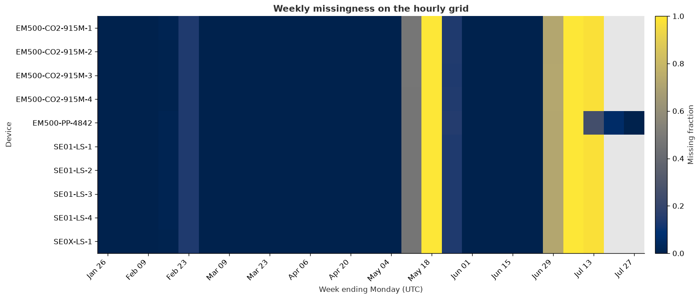
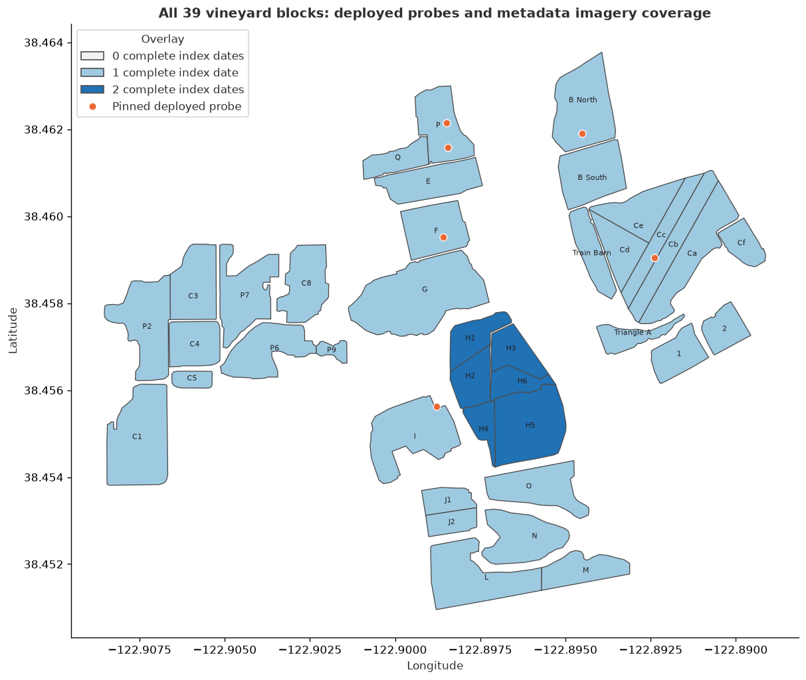

# Pipeline datasheet

Rendered from `notebooks/02_pipeline_datasheet.ipynb`. The committed notebook carries no
outputs; this page is the executed view. Regenerate with `uv run python scripts/render_notebooks.py`.

## D1 pipeline datasheet: what the pinned snapshots can support

This executable datasheet audits the **offline, DVC-pinned inputs** consumed by VINE's model tracks. It asks four practical questions before any modeling:

1. Which sensor channels exist, over what dates, and at what cadence?
2. Where are the hourly gaps, and are missing periods shared across devices?
3. Does daily weather, including reference evapotranspiration (ET₀), cover the sensor timeline after the production join?
4. Which of the 39 vineyard blocks have a deployed probe and metadata indicating usable imagery?

The notebook is narrative-first and intentionally reads no live services. Its figures describe availability, not biological validity or model performance.

## Reproduce this audit offline

From a checkout whose DVC cache has already been populated, restore the exact inputs with `uv run dvc pull`, then use **Restart & Run All**. Every data read below is from `data/raw/`; no InfluxDB, Open-Meteo, STAC, or NextCloud client is constructed.

The committed notebook is output-free. CI executes a disposable copy and discards its outputs:

```bash
uv run python scripts/check_notebooks.py notebooks/02_pipeline_datasheet.ipynb
```

Missing snapshots fail loudly rather than triggering a network fallback.

```python
from pathlib import Path

import matplotlib.pyplot as plt
import numpy as np
import pandas as pd
from IPython.display import display
from matplotlib.colors import BoundaryNorm, ListedColormap
from matplotlib.lines import Line2D
from matplotlib.patches import Patch

from vine.d1_pipeline.datasheet import (
    block_alignment_summary,
    dvc_snapshot_manifest,
    read_imagery_inventory,
    select_deployed_points,
    sensor_coverage,
    weather_coverage,
    weekly_missingness,
)
from vine.d1_pipeline.geo import load_blocks_kmz, load_points_kmz
from vine.d1_pipeline.ingest import load_snapshot, load_weather_snapshot
from vine.d1_pipeline.pipeline import attach_weather, build_sensor_features

ROOT = Path.cwd()
RAW = ROOT / "data" / "raw"
SENSORS = RAW / "sensors"
IMAGERY = RAW / "imagery"

required = [
    RAW / "sensors.dvc",
    RAW / "weather.dvc",
    RAW / "imagery.dvc",
    SENSORS,
    RAW / "weather",
    IMAGERY / "inventory.parquet",
    IMAGERY / "IHV-2026-05-26.kmz",
]
missing = [str(path.relative_to(ROOT)) for path in required if not path.exists()]
if missing:
    raise FileNotFoundError(f"Pinned inputs are missing; run `uv run dvc pull`: {missing}")

plt.rcParams.update(
    {
        "figure.dpi": 120,
        "axes.spines.top": False,
        "axes.spines.right": False,
        "axes.titleweight": "bold",
        "axes.labelcolor": "#303030",
        "text.color": "#303030",
    }
)
pd.set_option("display.max_rows", 100)
pd.set_option("display.max_columns", 30)
```

## 1. Provenance is part of the dataset

A snapshot is identified by its DVC directory hash, not merely by a filename or download date. The manifest below is read directly from the three tracked pointer files. Sizes are compressed/storage metadata from DVC and are not row counts.

This audit does **not** establish custody before ingestion, sensor calibration, or field interpretation. It establishes which immutable local snapshot was analyzed.

```python
dvc_paths = [RAW / "sensors.dvc", RAW / "weather.dvc", RAW / "imagery.dvc"]
provenance = dvc_snapshot_manifest(dvc_paths)
provenance["pointer"] = provenance["pointer"].map(lambda value: str(Path(value).relative_to(ROOT)))
provenance["size_mib"] = provenance["size_bytes"] / 1024**2
display(
    provenance[["pointer", "path", "md5", "nfiles", "size_mib"]]
    .sort_values("path")
    .style.format({"size_mib": "{:.2f}"})
)
```

<style type="text/css">
</style>
<table id="T_0b01f">
  <thead>
    <tr>
      <th class="blank level0" >&nbsp;</th>
      <th id="T_0b01f_level0_col0" class="col_heading level0 col0" >pointer</th>
      <th id="T_0b01f_level0_col1" class="col_heading level0 col1" >path</th>
      <th id="T_0b01f_level0_col2" class="col_heading level0 col2" >md5</th>
      <th id="T_0b01f_level0_col3" class="col_heading level0 col3" >nfiles</th>
      <th id="T_0b01f_level0_col4" class="col_heading level0 col4" >size_mib</th>
    </tr>
  </thead>
  <tbody>
    <tr>
      <th id="T_0b01f_level0_row0" class="row_heading level0 row0" >2</th>
      <td id="T_0b01f_row0_col0" class="data row0 col0" >data/raw/imagery.dvc</td>
      <td id="T_0b01f_row0_col1" class="data row0 col1" >imagery</td>
      <td id="T_0b01f_row0_col2" class="data row0 col2" >7178cd14767495cb8302bc3eb144d44f.dir</td>
      <td id="T_0b01f_row0_col3" class="data row0 col3" >6</td>
      <td id="T_0b01f_row0_col4" class="data row0 col4" >60.92</td>
    </tr>
    <tr>
      <th id="T_0b01f_level0_row1" class="row_heading level0 row1" >0</th>
      <td id="T_0b01f_row1_col0" class="data row1 col0" >data/raw/sensors.dvc</td>
      <td id="T_0b01f_row1_col1" class="data row1 col1" >sensors</td>
      <td id="T_0b01f_row1_col2" class="data row1 col2" >878fbba26d19b3f1428a5499c857e6cc.dir</td>
      <td id="T_0b01f_row1_col3" class="data row1 col3" >12</td>
      <td id="T_0b01f_row1_col4" class="data row1 col4" >11.20</td>
    </tr>
    <tr>
      <th id="T_0b01f_level0_row2" class="row_heading level0 row2" >1</th>
      <td id="T_0b01f_row2_col0" class="data row2 col0" >data/raw/weather.dvc</td>
      <td id="T_0b01f_row2_col1" class="data row2 col1" >weather</td>
      <td id="T_0b01f_row2_col2" class="data row2 col2" >8a92662662a7b9f61f9a4ed803dcc061.dir</td>
      <td id="T_0b01f_row2_col3" class="data row2 col3" >2</td>
      <td id="T_0b01f_row2_col4" class="data row2 col4" >0.06</td>
    </tr>
  </tbody>
</table>

### Known unknowns: do not turn availability into semantics

- **EM500-PP-4842:** the pinned column is `pipe_pressure_raw`. Its engineering unit, active direction, served block, and relationship to a real irrigation event are unverified. It is shown for completeness but must not be used as an irrigation-event label.
- **SE0X-LS-1:** its channels retain raw LoRa field names (including the `SOIL1` suffix). Probe depth, calibration, and engineering units still require field confirmation; this notebook does not silently rename or normalize them.
- **Gaps:** a missing hourly bin means no observation reached this snapshot. It does not distinguish probe failure, gateway outage, maintenance, or a true environmental state.
- **Weather:** Open-Meteo archive values are gridded historical estimates at vineyard coordinates, not an on-site weather-station measurement. ET₀ coverage is not ET₀ validation.
- **Imagery:** `available=True` is metadata inventory evidence. It does not prove cloud-free pixels, valid vegetation, geometric alignment quality, or a stress/pest label.
- Historical irrigation, harvest, yield, Brix, pH, TA, and supervised plant-health labels are absent from these pinned inputs. Their existence and semantics must be confirmed with the mentor.

## 2. Sensor coverage and cadence

Snapshots are loaded through `vine.d1_pipeline.ingest.load_snapshot`. Coverage is then computed by `vine.d1_pipeline.datasheet.sensor_coverage`, which regularizes each numeric channel to an hourly grid without imputing values. Raw cadence summarizes arrival spacing; hourly completeness summarizes analysis-ready bins. Those are different quantities and should not be conflated.

```python
sensor_files = sorted(SENSORS.glob("*.parquet"))
frames = {path.stem: load_snapshot(path.stem, SENSORS) for path in sensor_files}
if not frames:
    raise FileNotFoundError("No pinned sensor Parquet snapshots found")

coverage = sensor_coverage(frames, freq="1h")
coverage_table = coverage[
    [
        "device",
        "channel",
        "raw_rows",
        "start",
        "end",
        "median_cadence_min",
        "p90_cadence_min",
        "observed_bins",
        "expected_bins",
        "missing_pct",
    ]
].sort_values(["device", "channel"])

display(
    coverage_table.style.format(
        {
            "median_cadence_min": "{:.1f}",
            "p90_cadence_min": "{:.1f}",
            "missing_pct": "{:.1f}%",
        }
    )
)
```

<style type="text/css">
</style>
<table id="T_60303">
  <thead>
    <tr>
      <th class="blank level0" >&nbsp;</th>
      <th id="T_60303_level0_col0" class="col_heading level0 col0" >device</th>
      <th id="T_60303_level0_col1" class="col_heading level0 col1" >channel</th>
      <th id="T_60303_level0_col2" class="col_heading level0 col2" >raw_rows</th>
      <th id="T_60303_level0_col3" class="col_heading level0 col3" >start</th>
      <th id="T_60303_level0_col4" class="col_heading level0 col4" >end</th>
      <th id="T_60303_level0_col5" class="col_heading level0 col5" >median_cadence_min</th>
      <th id="T_60303_level0_col6" class="col_heading level0 col6" >p90_cadence_min</th>
      <th id="T_60303_level0_col7" class="col_heading level0 col7" >observed_bins</th>
      <th id="T_60303_level0_col8" class="col_heading level0 col8" >expected_bins</th>
      <th id="T_60303_level0_col9" class="col_heading level0 col9" >missing_pct</th>
    </tr>
  </thead>
  <tbody>
    <tr>
      <th id="T_60303_level0_row0" class="row_heading level0 row0" >0</th>
      <td id="T_60303_row0_col0" class="data row0 col0" >EM500-CO2-915M-1</td>
      <td id="T_60303_row0_col1" class="data row0 col1" >co2</td>
      <td id="T_60303_row0_col2" class="data row0 col2" >20037</td>
      <td id="T_60303_row0_col3" class="data row0 col3" >2026-01-22 00:19:44.371407+00:00</td>
      <td id="T_60303_row0_col4" class="data row0 col4" >2026-07-08 17:42:59.166872+00:00</td>
      <td id="T_60303_row0_col5" class="data row0 col5" >10.0</td>
      <td id="T_60303_row0_col6" class="data row0 col6" >10.0</td>
      <td id="T_60303_row0_col7" class="data row0 col7" >3400</td>
      <td id="T_60303_row0_col8" class="data row0 col8" >4026</td>
      <td id="T_60303_row0_col9" class="data row0 col9" >15.5%</td>
    </tr>
    <tr>
      <th id="T_60303_level0_row1" class="row_heading level0 row1" >1</th>
      <td id="T_60303_row1_col0" class="data row1 col0" >EM500-CO2-915M-1</td>
      <td id="T_60303_row1_col1" class="data row1 col1" >humidity</td>
      <td id="T_60303_row1_col2" class="data row1 col2" >20037</td>
      <td id="T_60303_row1_col3" class="data row1 col3" >2026-01-22 00:19:44.371407+00:00</td>
      <td id="T_60303_row1_col4" class="data row1 col4" >2026-07-08 17:42:59.166872+00:00</td>
      <td id="T_60303_row1_col5" class="data row1 col5" >10.0</td>
      <td id="T_60303_row1_col6" class="data row1 col6" >10.0</td>
      <td id="T_60303_row1_col7" class="data row1 col7" >3400</td>
      <td id="T_60303_row1_col8" class="data row1 col8" >4026</td>
      <td id="T_60303_row1_col9" class="data row1 col9" >15.5%</td>
    </tr>
    <tr>
      <th id="T_60303_level0_row2" class="row_heading level0 row2" >2</th>
      <td id="T_60303_row2_col0" class="data row2 col0" >EM500-CO2-915M-1</td>
      <td id="T_60303_row2_col1" class="data row2 col1" >pressure</td>
      <td id="T_60303_row2_col2" class="data row2 col2" >20037</td>
      <td id="T_60303_row2_col3" class="data row2 col3" >2026-01-22 00:19:44.371407+00:00</td>
      <td id="T_60303_row2_col4" class="data row2 col4" >2026-07-08 17:42:59.166872+00:00</td>
      <td id="T_60303_row2_col5" class="data row2 col5" >10.0</td>
      <td id="T_60303_row2_col6" class="data row2 col6" >10.0</td>
      <td id="T_60303_row2_col7" class="data row2 col7" >3400</td>
      <td id="T_60303_row2_col8" class="data row2 col8" >4026</td>
      <td id="T_60303_row2_col9" class="data row2 col9" >15.5%</td>
    </tr>
    <tr>
      <th id="T_60303_level0_row3" class="row_heading level0 row3" >3</th>
      <td id="T_60303_row3_col0" class="data row3 col0" >EM500-CO2-915M-1</td>
      <td id="T_60303_row3_col1" class="data row3 col1" >temperature</td>
      <td id="T_60303_row3_col2" class="data row3 col2" >20037</td>
      <td id="T_60303_row3_col3" class="data row3 col3" >2026-01-22 00:19:44.371407+00:00</td>
      <td id="T_60303_row3_col4" class="data row3 col4" >2026-07-08 17:42:59.166872+00:00</td>
      <td id="T_60303_row3_col5" class="data row3 col5" >10.0</td>
      <td id="T_60303_row3_col6" class="data row3 col6" >10.0</td>
      <td id="T_60303_row3_col7" class="data row3 col7" >3400</td>
      <td id="T_60303_row3_col8" class="data row3 col8" >4026</td>
      <td id="T_60303_row3_col9" class="data row3 col9" >15.5%</td>
    </tr>
    <tr>
      <th id="T_60303_level0_row4" class="row_heading level0 row4" >4</th>
      <td id="T_60303_row4_col0" class="data row4 col0" >EM500-CO2-915M-2</td>
      <td id="T_60303_row4_col1" class="data row4 col1" >co2</td>
      <td id="T_60303_row4_col2" class="data row4 col2" >19870</td>
      <td id="T_60303_row4_col3" class="data row4 col3" >2026-01-22 00:26:19.851093+00:00</td>
      <td id="T_60303_row4_col4" class="data row4 col4" >2026-07-08 17:41:45.261437+00:00</td>
      <td id="T_60303_row4_col5" class="data row4 col5" >10.0</td>
      <td id="T_60303_row4_col6" class="data row4 col6" >10.0</td>
      <td id="T_60303_row4_col7" class="data row4 col7" >3400</td>
      <td id="T_60303_row4_col8" class="data row4 col8" >4026</td>
      <td id="T_60303_row4_col9" class="data row4 col9" >15.5%</td>
    </tr>
    <tr>
      <th id="T_60303_level0_row5" class="row_heading level0 row5" >5</th>
      <td id="T_60303_row5_col0" class="data row5 col0" >EM500-CO2-915M-2</td>
      <td id="T_60303_row5_col1" class="data row5 col1" >humidity</td>
      <td id="T_60303_row5_col2" class="data row5 col2" >19870</td>
      <td id="T_60303_row5_col3" class="data row5 col3" >2026-01-22 00:26:19.851093+00:00</td>
      <td id="T_60303_row5_col4" class="data row5 col4" >2026-07-08 17:41:45.261437+00:00</td>
      <td id="T_60303_row5_col5" class="data row5 col5" >10.0</td>
      <td id="T_60303_row5_col6" class="data row5 col6" >10.0</td>
      <td id="T_60303_row5_col7" class="data row5 col7" >3400</td>
      <td id="T_60303_row5_col8" class="data row5 col8" >4026</td>
      <td id="T_60303_row5_col9" class="data row5 col9" >15.5%</td>
    </tr>
    <tr>
      <th id="T_60303_level0_row6" class="row_heading level0 row6" >6</th>
      <td id="T_60303_row6_col0" class="data row6 col0" >EM500-CO2-915M-2</td>
      <td id="T_60303_row6_col1" class="data row6 col1" >pressure</td>
      <td id="T_60303_row6_col2" class="data row6 col2" >19870</td>
      <td id="T_60303_row6_col3" class="data row6 col3" >2026-01-22 00:26:19.851093+00:00</td>
      <td id="T_60303_row6_col4" class="data row6 col4" >2026-07-08 17:41:45.261437+00:00</td>
      <td id="T_60303_row6_col5" class="data row6 col5" >10.0</td>
      <td id="T_60303_row6_col6" class="data row6 col6" >10.0</td>
      <td id="T_60303_row6_col7" class="data row6 col7" >3400</td>
      <td id="T_60303_row6_col8" class="data row6 col8" >4026</td>
      <td id="T_60303_row6_col9" class="data row6 col9" >15.5%</td>
    </tr>
    <tr>
      <th id="T_60303_level0_row7" class="row_heading level0 row7" >7</th>
      <td id="T_60303_row7_col0" class="data row7 col0" >EM500-CO2-915M-2</td>
      <td id="T_60303_row7_col1" class="data row7 col1" >temperature</td>
      <td id="T_60303_row7_col2" class="data row7 col2" >19870</td>
      <td id="T_60303_row7_col3" class="data row7 col3" >2026-01-22 00:26:19.851093+00:00</td>
      <td id="T_60303_row7_col4" class="data row7 col4" >2026-07-08 17:41:45.261437+00:00</td>
      <td id="T_60303_row7_col5" class="data row7 col5" >10.0</td>
      <td id="T_60303_row7_col6" class="data row7 col6" >10.0</td>
      <td id="T_60303_row7_col7" class="data row7 col7" >3400</td>
      <td id="T_60303_row7_col8" class="data row7 col8" >4026</td>
      <td id="T_60303_row7_col9" class="data row7 col9" >15.5%</td>
    </tr>
    <tr>
      <th id="T_60303_level0_row8" class="row_heading level0 row8" >8</th>
      <td id="T_60303_row8_col0" class="data row8 col0" >EM500-CO2-915M-3</td>
      <td id="T_60303_row8_col1" class="data row8 col1" >co2</td>
      <td id="T_60303_row8_col2" class="data row8 col2" >19858</td>
      <td id="T_60303_row8_col3" class="data row8 col3" >2026-01-22 00:28:35.134180+00:00</td>
      <td id="T_60303_row8_col4" class="data row8 col4" >2026-07-08 17:48:24.986478+00:00</td>
      <td id="T_60303_row8_col5" class="data row8 col5" >10.0</td>
      <td id="T_60303_row8_col6" class="data row8 col6" >10.0</td>
      <td id="T_60303_row8_col7" class="data row8 col7" >3400</td>
      <td id="T_60303_row8_col8" class="data row8 col8" >4026</td>
      <td id="T_60303_row8_col9" class="data row8 col9" >15.5%</td>
    </tr>
    <tr>
      <th id="T_60303_level0_row9" class="row_heading level0 row9" >9</th>
      <td id="T_60303_row9_col0" class="data row9 col0" >EM500-CO2-915M-3</td>
      <td id="T_60303_row9_col1" class="data row9 col1" >humidity</td>
      <td id="T_60303_row9_col2" class="data row9 col2" >19858</td>
      <td id="T_60303_row9_col3" class="data row9 col3" >2026-01-22 00:28:35.134180+00:00</td>
      <td id="T_60303_row9_col4" class="data row9 col4" >2026-07-08 17:48:24.986478+00:00</td>
      <td id="T_60303_row9_col5" class="data row9 col5" >10.0</td>
      <td id="T_60303_row9_col6" class="data row9 col6" >10.0</td>
      <td id="T_60303_row9_col7" class="data row9 col7" >3400</td>
      <td id="T_60303_row9_col8" class="data row9 col8" >4026</td>
      <td id="T_60303_row9_col9" class="data row9 col9" >15.5%</td>
    </tr>
    <tr>
      <th id="T_60303_level0_row10" class="row_heading level0 row10" >10</th>
      <td id="T_60303_row10_col0" class="data row10 col0" >EM500-CO2-915M-3</td>
      <td id="T_60303_row10_col1" class="data row10 col1" >pressure</td>
      <td id="T_60303_row10_col2" class="data row10 col2" >19858</td>
      <td id="T_60303_row10_col3" class="data row10 col3" >2026-01-22 00:28:35.134180+00:00</td>
      <td id="T_60303_row10_col4" class="data row10 col4" >2026-07-08 17:48:24.986478+00:00</td>
      <td id="T_60303_row10_col5" class="data row10 col5" >10.0</td>
      <td id="T_60303_row10_col6" class="data row10 col6" >10.0</td>
      <td id="T_60303_row10_col7" class="data row10 col7" >3400</td>
      <td id="T_60303_row10_col8" class="data row10 col8" >4026</td>
      <td id="T_60303_row10_col9" class="data row10 col9" >15.5%</td>
    </tr>
    <tr>
      <th id="T_60303_level0_row11" class="row_heading level0 row11" >11</th>
      <td id="T_60303_row11_col0" class="data row11 col0" >EM500-CO2-915M-3</td>
      <td id="T_60303_row11_col1" class="data row11 col1" >temperature</td>
      <td id="T_60303_row11_col2" class="data row11 col2" >19858</td>
      <td id="T_60303_row11_col3" class="data row11 col3" >2026-01-22 00:28:35.134180+00:00</td>
      <td id="T_60303_row11_col4" class="data row11 col4" >2026-07-08 17:48:24.986478+00:00</td>
      <td id="T_60303_row11_col5" class="data row11 col5" >10.0</td>
      <td id="T_60303_row11_col6" class="data row11 col6" >10.0</td>
      <td id="T_60303_row11_col7" class="data row11 col7" >3400</td>
      <td id="T_60303_row11_col8" class="data row11 col8" >4026</td>
      <td id="T_60303_row11_col9" class="data row11 col9" >15.5%</td>
    </tr>
    <tr>
      <th id="T_60303_level0_row12" class="row_heading level0 row12" >12</th>
      <td id="T_60303_row12_col0" class="data row12 col0" >EM500-CO2-915M-4</td>
      <td id="T_60303_row12_col1" class="data row12 col1" >co2</td>
      <td id="T_60303_row12_col2" class="data row12 col2" >20073</td>
      <td id="T_60303_row12_col3" class="data row12 col3" >2026-01-22 00:27:53.730707+00:00</td>
      <td id="T_60303_row12_col4" class="data row12 col4" >2026-07-08 17:47:55.230989+00:00</td>
      <td id="T_60303_row12_col5" class="data row12 col5" >10.0</td>
      <td id="T_60303_row12_col6" class="data row12 col6" >10.0</td>
      <td id="T_60303_row12_col7" class="data row12 col7" >3400</td>
      <td id="T_60303_row12_col8" class="data row12 col8" >4026</td>
      <td id="T_60303_row12_col9" class="data row12 col9" >15.5%</td>
    </tr>
    <tr>
      <th id="T_60303_level0_row13" class="row_heading level0 row13" >13</th>
      <td id="T_60303_row13_col0" class="data row13 col0" >EM500-CO2-915M-4</td>
      <td id="T_60303_row13_col1" class="data row13 col1" >humidity</td>
      <td id="T_60303_row13_col2" class="data row13 col2" >20073</td>
      <td id="T_60303_row13_col3" class="data row13 col3" >2026-01-22 00:27:53.730707+00:00</td>
      <td id="T_60303_row13_col4" class="data row13 col4" >2026-07-08 17:47:55.230989+00:00</td>
      <td id="T_60303_row13_col5" class="data row13 col5" >10.0</td>
      <td id="T_60303_row13_col6" class="data row13 col6" >10.0</td>
      <td id="T_60303_row13_col7" class="data row13 col7" >3400</td>
      <td id="T_60303_row13_col8" class="data row13 col8" >4026</td>
      <td id="T_60303_row13_col9" class="data row13 col9" >15.5%</td>
    </tr>
    <tr>
      <th id="T_60303_level0_row14" class="row_heading level0 row14" >14</th>
      <td id="T_60303_row14_col0" class="data row14 col0" >EM500-CO2-915M-4</td>
      <td id="T_60303_row14_col1" class="data row14 col1" >pressure</td>
      <td id="T_60303_row14_col2" class="data row14 col2" >20073</td>
      <td id="T_60303_row14_col3" class="data row14 col3" >2026-01-22 00:27:53.730707+00:00</td>
      <td id="T_60303_row14_col4" class="data row14 col4" >2026-07-08 17:47:55.230989+00:00</td>
      <td id="T_60303_row14_col5" class="data row14 col5" >10.0</td>
      <td id="T_60303_row14_col6" class="data row14 col6" >10.0</td>
      <td id="T_60303_row14_col7" class="data row14 col7" >3400</td>
      <td id="T_60303_row14_col8" class="data row14 col8" >4026</td>
      <td id="T_60303_row14_col9" class="data row14 col9" >15.5%</td>
    </tr>
    <tr>
      <th id="T_60303_level0_row15" class="row_heading level0 row15" >15</th>
      <td id="T_60303_row15_col0" class="data row15 col0" >EM500-CO2-915M-4</td>
      <td id="T_60303_row15_col1" class="data row15 col1" >temperature</td>
      <td id="T_60303_row15_col2" class="data row15 col2" >20073</td>
      <td id="T_60303_row15_col3" class="data row15 col3" >2026-01-22 00:27:53.730707+00:00</td>
      <td id="T_60303_row15_col4" class="data row15 col4" >2026-07-08 17:47:55.230989+00:00</td>
      <td id="T_60303_row15_col5" class="data row15 col5" >10.0</td>
      <td id="T_60303_row15_col6" class="data row15 col6" >10.0</td>
      <td id="T_60303_row15_col7" class="data row15 col7" >3400</td>
      <td id="T_60303_row15_col8" class="data row15 col8" >4026</td>
      <td id="T_60303_row15_col9" class="data row15 col9" >15.5%</td>
    </tr>
    <tr>
      <th id="T_60303_level0_row16" class="row_heading level0 row16" >16</th>
      <td id="T_60303_row16_col0" class="data row16 col0" >EM500-PP-4842</td>
      <td id="T_60303_row16_col1" class="data row16 col1" >pipe_pressure_raw</td>
      <td id="T_60303_row16_col2" class="data row16 col2" >22256</td>
      <td id="T_60303_row16_col3" class="data row16 col3" >2026-01-22 00:23:51.127951+00:00</td>
      <td id="T_60303_row16_col4" class="data row16 col4" >2026-07-23 22:21:44.922440+00:00</td>
      <td id="T_60303_row16_col5" class="data row16 col5" >10.0</td>
      <td id="T_60303_row16_col6" class="data row16 col6" >10.0</td>
      <td id="T_60303_row16_col7" class="data row16 col7" >3753</td>
      <td id="T_60303_row16_col8" class="data row16 col8" >4391</td>
      <td id="T_60303_row16_col9" class="data row16 col9" >14.5%</td>
    </tr>
    <tr>
      <th id="T_60303_level0_row17" class="row_heading level0 row17" >17</th>
      <td id="T_60303_row17_col0" class="data row17 col0" >SE01-LS-1</td>
      <td id="T_60303_row17_col1" class="data row17 col1" >soil_conductivity</td>
      <td id="T_60303_row17_col2" class="data row17 col2" >188350</td>
      <td id="T_60303_row17_col3" class="data row17 col3" >2026-01-22 00:35:56.701963+00:00</td>
      <td id="T_60303_row17_col4" class="data row17 col4" >2026-07-08 17:48:16.455094+00:00</td>
      <td id="T_60303_row17_col5" class="data row17 col5" >1.0</td>
      <td id="T_60303_row17_col6" class="data row17 col6" >1.0</td>
      <td id="T_60303_row17_col7" class="data row17 col7" >3401</td>
      <td id="T_60303_row17_col8" class="data row17 col8" >4026</td>
      <td id="T_60303_row17_col9" class="data row17 col9" >15.5%</td>
    </tr>
    <tr>
      <th id="T_60303_level0_row18" class="row_heading level0 row18" >18</th>
      <td id="T_60303_row18_col0" class="data row18 col0" >SE01-LS-1</td>
      <td id="T_60303_row18_col1" class="data row18 col1" >soil_temperature</td>
      <td id="T_60303_row18_col2" class="data row18 col2" >188350</td>
      <td id="T_60303_row18_col3" class="data row18 col3" >2026-01-22 00:35:56.701963+00:00</td>
      <td id="T_60303_row18_col4" class="data row18 col4" >2026-07-08 17:48:16.455094+00:00</td>
      <td id="T_60303_row18_col5" class="data row18 col5" >1.0</td>
      <td id="T_60303_row18_col6" class="data row18 col6" >1.0</td>
      <td id="T_60303_row18_col7" class="data row18 col7" >3401</td>
      <td id="T_60303_row18_col8" class="data row18 col8" >4026</td>
      <td id="T_60303_row18_col9" class="data row18 col9" >15.5%</td>
    </tr>
    <tr>
      <th id="T_60303_level0_row19" class="row_heading level0 row19" >19</th>
      <td id="T_60303_row19_col0" class="data row19 col0" >SE01-LS-1</td>
      <td id="T_60303_row19_col1" class="data row19 col1" >soil_water</td>
      <td id="T_60303_row19_col2" class="data row19 col2" >188350</td>
      <td id="T_60303_row19_col3" class="data row19 col3" >2026-01-22 00:35:56.701963+00:00</td>
      <td id="T_60303_row19_col4" class="data row19 col4" >2026-07-08 17:48:16.455094+00:00</td>
      <td id="T_60303_row19_col5" class="data row19 col5" >1.0</td>
      <td id="T_60303_row19_col6" class="data row19 col6" >1.0</td>
      <td id="T_60303_row19_col7" class="data row19 col7" >3401</td>
      <td id="T_60303_row19_col8" class="data row19 col8" >4026</td>
      <td id="T_60303_row19_col9" class="data row19 col9" >15.5%</td>
    </tr>
    <tr>
      <th id="T_60303_level0_row20" class="row_heading level0 row20" >20</th>
      <td id="T_60303_row20_col0" class="data row20 col0" >SE01-LS-2</td>
      <td id="T_60303_row20_col1" class="data row20 col1" >soil_conductivity</td>
      <td id="T_60303_row20_col2" class="data row20 col2" >188771</td>
      <td id="T_60303_row20_col3" class="data row20 col3" >2026-01-22 00:32:03.517409+00:00</td>
      <td id="T_60303_row20_col4" class="data row20 col4" >2026-07-08 17:48:53.220565+00:00</td>
      <td id="T_60303_row20_col5" class="data row20 col5" >1.0</td>
      <td id="T_60303_row20_col6" class="data row20 col6" >1.0</td>
      <td id="T_60303_row20_col7" class="data row20 col7" >3401</td>
      <td id="T_60303_row20_col8" class="data row20 col8" >4026</td>
      <td id="T_60303_row20_col9" class="data row20 col9" >15.5%</td>
    </tr>
    <tr>
      <th id="T_60303_level0_row21" class="row_heading level0 row21" >21</th>
      <td id="T_60303_row21_col0" class="data row21 col0" >SE01-LS-2</td>
      <td id="T_60303_row21_col1" class="data row21 col1" >soil_temperature</td>
      <td id="T_60303_row21_col2" class="data row21 col2" >188771</td>
      <td id="T_60303_row21_col3" class="data row21 col3" >2026-01-22 00:32:03.517409+00:00</td>
      <td id="T_60303_row21_col4" class="data row21 col4" >2026-07-08 17:48:53.220565+00:00</td>
      <td id="T_60303_row21_col5" class="data row21 col5" >1.0</td>
      <td id="T_60303_row21_col6" class="data row21 col6" >1.0</td>
      <td id="T_60303_row21_col7" class="data row21 col7" >3401</td>
      <td id="T_60303_row21_col8" class="data row21 col8" >4026</td>
      <td id="T_60303_row21_col9" class="data row21 col9" >15.5%</td>
    </tr>
    <tr>
      <th id="T_60303_level0_row22" class="row_heading level0 row22" >22</th>
      <td id="T_60303_row22_col0" class="data row22 col0" >SE01-LS-2</td>
      <td id="T_60303_row22_col1" class="data row22 col1" >soil_water</td>
      <td id="T_60303_row22_col2" class="data row22 col2" >188771</td>
      <td id="T_60303_row22_col3" class="data row22 col3" >2026-01-22 00:32:03.517409+00:00</td>
      <td id="T_60303_row22_col4" class="data row22 col4" >2026-07-08 17:48:53.220565+00:00</td>
      <td id="T_60303_row22_col5" class="data row22 col5" >1.0</td>
      <td id="T_60303_row22_col6" class="data row22 col6" >1.0</td>
      <td id="T_60303_row22_col7" class="data row22 col7" >3401</td>
      <td id="T_60303_row22_col8" class="data row22 col8" >4026</td>
      <td id="T_60303_row22_col9" class="data row22 col9" >15.5%</td>
    </tr>
    <tr>
      <th id="T_60303_level0_row23" class="row_heading level0 row23" >23</th>
      <td id="T_60303_row23_col0" class="data row23 col0" >SE01-LS-3</td>
      <td id="T_60303_row23_col1" class="data row23 col1" >soil_conductivity</td>
      <td id="T_60303_row23_col2" class="data row23 col2" >200098</td>
      <td id="T_60303_row23_col3" class="data row23 col3" >2026-01-22 00:20:22.044483+00:00</td>
      <td id="T_60303_row23_col4" class="data row23 col4" >2026-07-08 17:49:09.815343+00:00</td>
      <td id="T_60303_row23_col5" class="data row23 col5" >1.0</td>
      <td id="T_60303_row23_col6" class="data row23 col6" >1.0</td>
      <td id="T_60303_row23_col7" class="data row23 col7" >3401</td>
      <td id="T_60303_row23_col8" class="data row23 col8" >4026</td>
      <td id="T_60303_row23_col9" class="data row23 col9" >15.5%</td>
    </tr>
    <tr>
      <th id="T_60303_level0_row24" class="row_heading level0 row24" >24</th>
      <td id="T_60303_row24_col0" class="data row24 col0" >SE01-LS-3</td>
      <td id="T_60303_row24_col1" class="data row24 col1" >soil_temperature</td>
      <td id="T_60303_row24_col2" class="data row24 col2" >200098</td>
      <td id="T_60303_row24_col3" class="data row24 col3" >2026-01-22 00:20:22.044483+00:00</td>
      <td id="T_60303_row24_col4" class="data row24 col4" >2026-07-08 17:49:09.815343+00:00</td>
      <td id="T_60303_row24_col5" class="data row24 col5" >1.0</td>
      <td id="T_60303_row24_col6" class="data row24 col6" >1.0</td>
      <td id="T_60303_row24_col7" class="data row24 col7" >3401</td>
      <td id="T_60303_row24_col8" class="data row24 col8" >4026</td>
      <td id="T_60303_row24_col9" class="data row24 col9" >15.5%</td>
    </tr>
    <tr>
      <th id="T_60303_level0_row25" class="row_heading level0 row25" >25</th>
      <td id="T_60303_row25_col0" class="data row25 col0" >SE01-LS-3</td>
      <td id="T_60303_row25_col1" class="data row25 col1" >soil_water</td>
      <td id="T_60303_row25_col2" class="data row25 col2" >200098</td>
      <td id="T_60303_row25_col3" class="data row25 col3" >2026-01-22 00:20:22.044483+00:00</td>
      <td id="T_60303_row25_col4" class="data row25 col4" >2026-07-08 17:49:09.815343+00:00</td>
      <td id="T_60303_row25_col5" class="data row25 col5" >1.0</td>
      <td id="T_60303_row25_col6" class="data row25 col6" >1.0</td>
      <td id="T_60303_row25_col7" class="data row25 col7" >3401</td>
      <td id="T_60303_row25_col8" class="data row25 col8" >4026</td>
      <td id="T_60303_row25_col9" class="data row25 col9" >15.5%</td>
    </tr>
    <tr>
      <th id="T_60303_level0_row26" class="row_heading level0 row26" >26</th>
      <td id="T_60303_row26_col0" class="data row26 col0" >SE01-LS-4</td>
      <td id="T_60303_row26_col1" class="data row26 col1" >soil_conductivity</td>
      <td id="T_60303_row26_col2" class="data row26 col2" >201992</td>
      <td id="T_60303_row26_col3" class="data row26 col3" >2026-01-22 00:20:21.090971+00:00</td>
      <td id="T_60303_row26_col4" class="data row26 col4" >2026-07-08 17:49:23.468873+00:00</td>
      <td id="T_60303_row26_col5" class="data row26 col5" >1.0</td>
      <td id="T_60303_row26_col6" class="data row26 col6" >1.0</td>
      <td id="T_60303_row26_col7" class="data row26 col7" >3401</td>
      <td id="T_60303_row26_col8" class="data row26 col8" >4026</td>
      <td id="T_60303_row26_col9" class="data row26 col9" >15.5%</td>
    </tr>
    <tr>
      <th id="T_60303_level0_row27" class="row_heading level0 row27" >27</th>
      <td id="T_60303_row27_col0" class="data row27 col0" >SE01-LS-4</td>
      <td id="T_60303_row27_col1" class="data row27 col1" >soil_temperature</td>
      <td id="T_60303_row27_col2" class="data row27 col2" >201992</td>
      <td id="T_60303_row27_col3" class="data row27 col3" >2026-01-22 00:20:21.090971+00:00</td>
      <td id="T_60303_row27_col4" class="data row27 col4" >2026-07-08 17:49:23.468873+00:00</td>
      <td id="T_60303_row27_col5" class="data row27 col5" >1.0</td>
      <td id="T_60303_row27_col6" class="data row27 col6" >1.0</td>
      <td id="T_60303_row27_col7" class="data row27 col7" >3401</td>
      <td id="T_60303_row27_col8" class="data row27 col8" >4026</td>
      <td id="T_60303_row27_col9" class="data row27 col9" >15.5%</td>
    </tr>
    <tr>
      <th id="T_60303_level0_row28" class="row_heading level0 row28" >28</th>
      <td id="T_60303_row28_col0" class="data row28 col0" >SE01-LS-4</td>
      <td id="T_60303_row28_col1" class="data row28 col1" >soil_water</td>
      <td id="T_60303_row28_col2" class="data row28 col2" >201992</td>
      <td id="T_60303_row28_col3" class="data row28 col3" >2026-01-22 00:20:21.090971+00:00</td>
      <td id="T_60303_row28_col4" class="data row28 col4" >2026-07-08 17:49:23.468873+00:00</td>
      <td id="T_60303_row28_col5" class="data row28 col5" >1.0</td>
      <td id="T_60303_row28_col6" class="data row28 col6" >1.0</td>
      <td id="T_60303_row28_col7" class="data row28 col7" >3401</td>
      <td id="T_60303_row28_col8" class="data row28 col8" >4026</td>
      <td id="T_60303_row28_col9" class="data row28 col9" >15.5%</td>
    </tr>
    <tr>
      <th id="T_60303_level0_row29" class="row_heading level0 row29" >29</th>
      <td id="T_60303_row29_col0" class="data row29 col0" >SE0X-LS-1</td>
      <td id="T_60303_row29_col1" class="data row29 col1" >device_frmpayload_data_conduct_SOIL1</td>
      <td id="T_60303_row29_col2" class="data row29 col2" >177227</td>
      <td id="T_60303_row29_col3" class="data row29 col3" >2026-01-22 00:26:40.617094+00:00</td>
      <td id="T_60303_row29_col4" class="data row29 col4" >2026-07-08 17:49:01.242709+00:00</td>
      <td id="T_60303_row29_col5" class="data row29 col5" >1.0</td>
      <td id="T_60303_row29_col6" class="data row29 col6" >1.0</td>
      <td id="T_60303_row29_col7" class="data row29 col7" >3402</td>
      <td id="T_60303_row29_col8" class="data row29 col8" >4026</td>
      <td id="T_60303_row29_col9" class="data row29 col9" >15.5%</td>
    </tr>
    <tr>
      <th id="T_60303_level0_row30" class="row_heading level0 row30" >30</th>
      <td id="T_60303_row30_col0" class="data row30 col0" >SE0X-LS-1</td>
      <td id="T_60303_row30_col1" class="data row30 col1" >device_frmpayload_data_temp_SOIL1</td>
      <td id="T_60303_row30_col2" class="data row30 col2" >177227</td>
      <td id="T_60303_row30_col3" class="data row30 col3" >2026-01-22 00:26:40.617094+00:00</td>
      <td id="T_60303_row30_col4" class="data row30 col4" >2026-07-08 17:49:01.242709+00:00</td>
      <td id="T_60303_row30_col5" class="data row30 col5" >1.0</td>
      <td id="T_60303_row30_col6" class="data row30 col6" >1.0</td>
      <td id="T_60303_row30_col7" class="data row30 col7" >3402</td>
      <td id="T_60303_row30_col8" class="data row30 col8" >4026</td>
      <td id="T_60303_row30_col9" class="data row30 col9" >15.5%</td>
    </tr>
    <tr>
      <th id="T_60303_level0_row31" class="row_heading level0 row31" >31</th>
      <td id="T_60303_row31_col0" class="data row31 col0" >SE0X-LS-1</td>
      <td id="T_60303_row31_col1" class="data row31 col1" >device_frmpayload_data_water_SOIL1</td>
      <td id="T_60303_row31_col2" class="data row31 col2" >177227</td>
      <td id="T_60303_row31_col3" class="data row31 col3" >2026-01-22 00:26:40.617094+00:00</td>
      <td id="T_60303_row31_col4" class="data row31 col4" >2026-07-08 17:49:01.242709+00:00</td>
      <td id="T_60303_row31_col5" class="data row31 col5" >1.0</td>
      <td id="T_60303_row31_col6" class="data row31 col6" >1.0</td>
      <td id="T_60303_row31_col7" class="data row31 col7" >3402</td>
      <td id="T_60303_row31_col8" class="data row31 col8" >4026</td>
      <td id="T_60303_row31_col9" class="data row31 col9" >15.5%</td>
    </tr>
  </tbody>
</table>

### Gap table

The longest-gap count is in consecutive **hourly bins**. Sorting by missing percentage surfaces the weakest channel/device combinations while preserving every channel in the table. Shared missing periods are visible more clearly in the weekly heatmap that follows.

```python
gap_table = coverage[
    ["device", "channel", "missing_bins", "missing_pct", "longest_gap_bins"]
].sort_values(["missing_pct", "longest_gap_bins"], ascending=False)
display(gap_table.style.format({"missing_pct": "{:.1f}%"}))
```

<style type="text/css">
</style>
<table id="T_2f50a">
  <thead>
    <tr>
      <th class="blank level0" >&nbsp;</th>
      <th id="T_2f50a_level0_col0" class="col_heading level0 col0" >device</th>
      <th id="T_2f50a_level0_col1" class="col_heading level0 col1" >channel</th>
      <th id="T_2f50a_level0_col2" class="col_heading level0 col2" >missing_bins</th>
      <th id="T_2f50a_level0_col3" class="col_heading level0 col3" >missing_pct</th>
      <th id="T_2f50a_level0_col4" class="col_heading level0 col4" >longest_gap_bins</th>
    </tr>
  </thead>
  <tbody>
    <tr>
      <th id="T_2f50a_level0_row0" class="row_heading level0 row0" >8</th>
      <td id="T_2f50a_row0_col0" class="data row0 col0" >EM500-CO2-915M-3</td>
      <td id="T_2f50a_row0_col1" class="data row0 col1" >co2</td>
      <td id="T_2f50a_row0_col2" class="data row0 col2" >626</td>
      <td id="T_2f50a_row0_col3" class="data row0 col3" >15.5%</td>
      <td id="T_2f50a_row0_col4" class="data row0 col4" >331</td>
    </tr>
    <tr>
      <th id="T_2f50a_level0_row1" class="row_heading level0 row1" >9</th>
      <td id="T_2f50a_row1_col0" class="data row1 col0" >EM500-CO2-915M-3</td>
      <td id="T_2f50a_row1_col1" class="data row1 col1" >humidity</td>
      <td id="T_2f50a_row1_col2" class="data row1 col2" >626</td>
      <td id="T_2f50a_row1_col3" class="data row1 col3" >15.5%</td>
      <td id="T_2f50a_row1_col4" class="data row1 col4" >331</td>
    </tr>
    <tr>
      <th id="T_2f50a_level0_row2" class="row_heading level0 row2" >10</th>
      <td id="T_2f50a_row2_col0" class="data row2 col0" >EM500-CO2-915M-3</td>
      <td id="T_2f50a_row2_col1" class="data row2 col1" >pressure</td>
      <td id="T_2f50a_row2_col2" class="data row2 col2" >626</td>
      <td id="T_2f50a_row2_col3" class="data row2 col3" >15.5%</td>
      <td id="T_2f50a_row2_col4" class="data row2 col4" >331</td>
    </tr>
    <tr>
      <th id="T_2f50a_level0_row3" class="row_heading level0 row3" >11</th>
      <td id="T_2f50a_row3_col0" class="data row3 col0" >EM500-CO2-915M-3</td>
      <td id="T_2f50a_row3_col1" class="data row3 col1" >temperature</td>
      <td id="T_2f50a_row3_col2" class="data row3 col2" >626</td>
      <td id="T_2f50a_row3_col3" class="data row3 col3" >15.5%</td>
      <td id="T_2f50a_row3_col4" class="data row3 col4" >331</td>
    </tr>
    <tr>
      <th id="T_2f50a_level0_row4" class="row_heading level0 row4" >12</th>
      <td id="T_2f50a_row4_col0" class="data row4 col0" >EM500-CO2-915M-4</td>
      <td id="T_2f50a_row4_col1" class="data row4 col1" >co2</td>
      <td id="T_2f50a_row4_col2" class="data row4 col2" >626</td>
      <td id="T_2f50a_row4_col3" class="data row4 col3" >15.5%</td>
      <td id="T_2f50a_row4_col4" class="data row4 col4" >331</td>
    </tr>
    <tr>
      <th id="T_2f50a_level0_row5" class="row_heading level0 row5" >13</th>
      <td id="T_2f50a_row5_col0" class="data row5 col0" >EM500-CO2-915M-4</td>
      <td id="T_2f50a_row5_col1" class="data row5 col1" >humidity</td>
      <td id="T_2f50a_row5_col2" class="data row5 col2" >626</td>
      <td id="T_2f50a_row5_col3" class="data row5 col3" >15.5%</td>
      <td id="T_2f50a_row5_col4" class="data row5 col4" >331</td>
    </tr>
    <tr>
      <th id="T_2f50a_level0_row6" class="row_heading level0 row6" >14</th>
      <td id="T_2f50a_row6_col0" class="data row6 col0" >EM500-CO2-915M-4</td>
      <td id="T_2f50a_row6_col1" class="data row6 col1" >pressure</td>
      <td id="T_2f50a_row6_col2" class="data row6 col2" >626</td>
      <td id="T_2f50a_row6_col3" class="data row6 col3" >15.5%</td>
      <td id="T_2f50a_row6_col4" class="data row6 col4" >331</td>
    </tr>
    <tr>
      <th id="T_2f50a_level0_row7" class="row_heading level0 row7" >15</th>
      <td id="T_2f50a_row7_col0" class="data row7 col0" >EM500-CO2-915M-4</td>
      <td id="T_2f50a_row7_col1" class="data row7 col1" >temperature</td>
      <td id="T_2f50a_row7_col2" class="data row7 col2" >626</td>
      <td id="T_2f50a_row7_col3" class="data row7 col3" >15.5%</td>
      <td id="T_2f50a_row7_col4" class="data row7 col4" >331</td>
    </tr>
    <tr>
      <th id="T_2f50a_level0_row8" class="row_heading level0 row8" >0</th>
      <td id="T_2f50a_row8_col0" class="data row8 col0" >EM500-CO2-915M-1</td>
      <td id="T_2f50a_row8_col1" class="data row8 col1" >co2</td>
      <td id="T_2f50a_row8_col2" class="data row8 col2" >626</td>
      <td id="T_2f50a_row8_col3" class="data row8 col3" >15.5%</td>
      <td id="T_2f50a_row8_col4" class="data row8 col4" >330</td>
    </tr>
    <tr>
      <th id="T_2f50a_level0_row9" class="row_heading level0 row9" >1</th>
      <td id="T_2f50a_row9_col0" class="data row9 col0" >EM500-CO2-915M-1</td>
      <td id="T_2f50a_row9_col1" class="data row9 col1" >humidity</td>
      <td id="T_2f50a_row9_col2" class="data row9 col2" >626</td>
      <td id="T_2f50a_row9_col3" class="data row9 col3" >15.5%</td>
      <td id="T_2f50a_row9_col4" class="data row9 col4" >330</td>
    </tr>
    <tr>
      <th id="T_2f50a_level0_row10" class="row_heading level0 row10" >2</th>
      <td id="T_2f50a_row10_col0" class="data row10 col0" >EM500-CO2-915M-1</td>
      <td id="T_2f50a_row10_col1" class="data row10 col1" >pressure</td>
      <td id="T_2f50a_row10_col2" class="data row10 col2" >626</td>
      <td id="T_2f50a_row10_col3" class="data row10 col3" >15.5%</td>
      <td id="T_2f50a_row10_col4" class="data row10 col4" >330</td>
    </tr>
    <tr>
      <th id="T_2f50a_level0_row11" class="row_heading level0 row11" >3</th>
      <td id="T_2f50a_row11_col0" class="data row11 col0" >EM500-CO2-915M-1</td>
      <td id="T_2f50a_row11_col1" class="data row11 col1" >temperature</td>
      <td id="T_2f50a_row11_col2" class="data row11 col2" >626</td>
      <td id="T_2f50a_row11_col3" class="data row11 col3" >15.5%</td>
      <td id="T_2f50a_row11_col4" class="data row11 col4" >330</td>
    </tr>
    <tr>
      <th id="T_2f50a_level0_row12" class="row_heading level0 row12" >4</th>
      <td id="T_2f50a_row12_col0" class="data row12 col0" >EM500-CO2-915M-2</td>
      <td id="T_2f50a_row12_col1" class="data row12 col1" >co2</td>
      <td id="T_2f50a_row12_col2" class="data row12 col2" >626</td>
      <td id="T_2f50a_row12_col3" class="data row12 col3" >15.5%</td>
      <td id="T_2f50a_row12_col4" class="data row12 col4" >330</td>
    </tr>
    <tr>
      <th id="T_2f50a_level0_row13" class="row_heading level0 row13" >5</th>
      <td id="T_2f50a_row13_col0" class="data row13 col0" >EM500-CO2-915M-2</td>
      <td id="T_2f50a_row13_col1" class="data row13 col1" >humidity</td>
      <td id="T_2f50a_row13_col2" class="data row13 col2" >626</td>
      <td id="T_2f50a_row13_col3" class="data row13 col3" >15.5%</td>
      <td id="T_2f50a_row13_col4" class="data row13 col4" >330</td>
    </tr>
    <tr>
      <th id="T_2f50a_level0_row14" class="row_heading level0 row14" >6</th>
      <td id="T_2f50a_row14_col0" class="data row14 col0" >EM500-CO2-915M-2</td>
      <td id="T_2f50a_row14_col1" class="data row14 col1" >pressure</td>
      <td id="T_2f50a_row14_col2" class="data row14 col2" >626</td>
      <td id="T_2f50a_row14_col3" class="data row14 col3" >15.5%</td>
      <td id="T_2f50a_row14_col4" class="data row14 col4" >330</td>
    </tr>
    <tr>
      <th id="T_2f50a_level0_row15" class="row_heading level0 row15" >7</th>
      <td id="T_2f50a_row15_col0" class="data row15 col0" >EM500-CO2-915M-2</td>
      <td id="T_2f50a_row15_col1" class="data row15 col1" >temperature</td>
      <td id="T_2f50a_row15_col2" class="data row15 col2" >626</td>
      <td id="T_2f50a_row15_col3" class="data row15 col3" >15.5%</td>
      <td id="T_2f50a_row15_col4" class="data row15 col4" >330</td>
    </tr>
    <tr>
      <th id="T_2f50a_level0_row16" class="row_heading level0 row16" >17</th>
      <td id="T_2f50a_row16_col0" class="data row16 col0" >SE01-LS-1</td>
      <td id="T_2f50a_row16_col1" class="data row16 col1" >soil_conductivity</td>
      <td id="T_2f50a_row16_col2" class="data row16 col2" >625</td>
      <td id="T_2f50a_row16_col3" class="data row16 col3" >15.5%</td>
      <td id="T_2f50a_row16_col4" class="data row16 col4" >330</td>
    </tr>
    <tr>
      <th id="T_2f50a_level0_row17" class="row_heading level0 row17" >18</th>
      <td id="T_2f50a_row17_col0" class="data row17 col0" >SE01-LS-1</td>
      <td id="T_2f50a_row17_col1" class="data row17 col1" >soil_temperature</td>
      <td id="T_2f50a_row17_col2" class="data row17 col2" >625</td>
      <td id="T_2f50a_row17_col3" class="data row17 col3" >15.5%</td>
      <td id="T_2f50a_row17_col4" class="data row17 col4" >330</td>
    </tr>
    <tr>
      <th id="T_2f50a_level0_row18" class="row_heading level0 row18" >19</th>
      <td id="T_2f50a_row18_col0" class="data row18 col0" >SE01-LS-1</td>
      <td id="T_2f50a_row18_col1" class="data row18 col1" >soil_water</td>
      <td id="T_2f50a_row18_col2" class="data row18 col2" >625</td>
      <td id="T_2f50a_row18_col3" class="data row18 col3" >15.5%</td>
      <td id="T_2f50a_row18_col4" class="data row18 col4" >330</td>
    </tr>
    <tr>
      <th id="T_2f50a_level0_row19" class="row_heading level0 row19" >20</th>
      <td id="T_2f50a_row19_col0" class="data row19 col0" >SE01-LS-2</td>
      <td id="T_2f50a_row19_col1" class="data row19 col1" >soil_conductivity</td>
      <td id="T_2f50a_row19_col2" class="data row19 col2" >625</td>
      <td id="T_2f50a_row19_col3" class="data row19 col3" >15.5%</td>
      <td id="T_2f50a_row19_col4" class="data row19 col4" >330</td>
    </tr>
    <tr>
      <th id="T_2f50a_level0_row20" class="row_heading level0 row20" >21</th>
      <td id="T_2f50a_row20_col0" class="data row20 col0" >SE01-LS-2</td>
      <td id="T_2f50a_row20_col1" class="data row20 col1" >soil_temperature</td>
      <td id="T_2f50a_row20_col2" class="data row20 col2" >625</td>
      <td id="T_2f50a_row20_col3" class="data row20 col3" >15.5%</td>
      <td id="T_2f50a_row20_col4" class="data row20 col4" >330</td>
    </tr>
    <tr>
      <th id="T_2f50a_level0_row21" class="row_heading level0 row21" >22</th>
      <td id="T_2f50a_row21_col0" class="data row21 col0" >SE01-LS-2</td>
      <td id="T_2f50a_row21_col1" class="data row21 col1" >soil_water</td>
      <td id="T_2f50a_row21_col2" class="data row21 col2" >625</td>
      <td id="T_2f50a_row21_col3" class="data row21 col3" >15.5%</td>
      <td id="T_2f50a_row21_col4" class="data row21 col4" >330</td>
    </tr>
    <tr>
      <th id="T_2f50a_level0_row22" class="row_heading level0 row22" >23</th>
      <td id="T_2f50a_row22_col0" class="data row22 col0" >SE01-LS-3</td>
      <td id="T_2f50a_row22_col1" class="data row22 col1" >soil_conductivity</td>
      <td id="T_2f50a_row22_col2" class="data row22 col2" >625</td>
      <td id="T_2f50a_row22_col3" class="data row22 col3" >15.5%</td>
      <td id="T_2f50a_row22_col4" class="data row22 col4" >330</td>
    </tr>
    <tr>
      <th id="T_2f50a_level0_row23" class="row_heading level0 row23" >24</th>
      <td id="T_2f50a_row23_col0" class="data row23 col0" >SE01-LS-3</td>
      <td id="T_2f50a_row23_col1" class="data row23 col1" >soil_temperature</td>
      <td id="T_2f50a_row23_col2" class="data row23 col2" >625</td>
      <td id="T_2f50a_row23_col3" class="data row23 col3" >15.5%</td>
      <td id="T_2f50a_row23_col4" class="data row23 col4" >330</td>
    </tr>
    <tr>
      <th id="T_2f50a_level0_row24" class="row_heading level0 row24" >25</th>
      <td id="T_2f50a_row24_col0" class="data row24 col0" >SE01-LS-3</td>
      <td id="T_2f50a_row24_col1" class="data row24 col1" >soil_water</td>
      <td id="T_2f50a_row24_col2" class="data row24 col2" >625</td>
      <td id="T_2f50a_row24_col3" class="data row24 col3" >15.5%</td>
      <td id="T_2f50a_row24_col4" class="data row24 col4" >330</td>
    </tr>
    <tr>
      <th id="T_2f50a_level0_row25" class="row_heading level0 row25" >26</th>
      <td id="T_2f50a_row25_col0" class="data row25 col0" >SE01-LS-4</td>
      <td id="T_2f50a_row25_col1" class="data row25 col1" >soil_conductivity</td>
      <td id="T_2f50a_row25_col2" class="data row25 col2" >625</td>
      <td id="T_2f50a_row25_col3" class="data row25 col3" >15.5%</td>
      <td id="T_2f50a_row25_col4" class="data row25 col4" >330</td>
    </tr>
    <tr>
      <th id="T_2f50a_level0_row26" class="row_heading level0 row26" >27</th>
      <td id="T_2f50a_row26_col0" class="data row26 col0" >SE01-LS-4</td>
      <td id="T_2f50a_row26_col1" class="data row26 col1" >soil_temperature</td>
      <td id="T_2f50a_row26_col2" class="data row26 col2" >625</td>
      <td id="T_2f50a_row26_col3" class="data row26 col3" >15.5%</td>
      <td id="T_2f50a_row26_col4" class="data row26 col4" >330</td>
    </tr>
    <tr>
      <th id="T_2f50a_level0_row27" class="row_heading level0 row27" >28</th>
      <td id="T_2f50a_row27_col0" class="data row27 col0" >SE01-LS-4</td>
      <td id="T_2f50a_row27_col1" class="data row27 col1" >soil_water</td>
      <td id="T_2f50a_row27_col2" class="data row27 col2" >625</td>
      <td id="T_2f50a_row27_col3" class="data row27 col3" >15.5%</td>
      <td id="T_2f50a_row27_col4" class="data row27 col4" >330</td>
    </tr>
    <tr>
      <th id="T_2f50a_level0_row28" class="row_heading level0 row28" >29</th>
      <td id="T_2f50a_row28_col0" class="data row28 col0" >SE0X-LS-1</td>
      <td id="T_2f50a_row28_col1" class="data row28 col1" >device_frmpayload_data_conduct_SOIL1</td>
      <td id="T_2f50a_row28_col2" class="data row28 col2" >624</td>
      <td id="T_2f50a_row28_col3" class="data row28 col3" >15.5%</td>
      <td id="T_2f50a_row28_col4" class="data row28 col4" >330</td>
    </tr>
    <tr>
      <th id="T_2f50a_level0_row29" class="row_heading level0 row29" >30</th>
      <td id="T_2f50a_row29_col0" class="data row29 col0" >SE0X-LS-1</td>
      <td id="T_2f50a_row29_col1" class="data row29 col1" >device_frmpayload_data_temp_SOIL1</td>
      <td id="T_2f50a_row29_col2" class="data row29 col2" >624</td>
      <td id="T_2f50a_row29_col3" class="data row29 col3" >15.5%</td>
      <td id="T_2f50a_row29_col4" class="data row29 col4" >330</td>
    </tr>
    <tr>
      <th id="T_2f50a_level0_row30" class="row_heading level0 row30" >31</th>
      <td id="T_2f50a_row30_col0" class="data row30 col0" >SE0X-LS-1</td>
      <td id="T_2f50a_row30_col1" class="data row30 col1" >device_frmpayload_data_water_SOIL1</td>
      <td id="T_2f50a_row30_col2" class="data row30 col2" >624</td>
      <td id="T_2f50a_row30_col3" class="data row30 col3" >15.5%</td>
      <td id="T_2f50a_row30_col4" class="data row30 col4" >330</td>
    </tr>
    <tr>
      <th id="T_2f50a_level0_row31" class="row_heading level0 row31" >16</th>
      <td id="T_2f50a_row31_col0" class="data row31 col0" >EM500-PP-4842</td>
      <td id="T_2f50a_row31_col1" class="data row31 col1" >pipe_pressure_raw</td>
      <td id="T_2f50a_row31_col2" class="data row31 col2" >638</td>
      <td id="T_2f50a_row31_col3" class="data row31 col3" >14.5%</td>
      <td id="T_2f50a_row31_col4" class="data row31 col4" >331</td>
    </tr>
  </tbody>
</table>

### Weekly missingness: one representative channel per device

To keep the heatmap interpretable, each row uses one declared representative channel: temperature for air probes, soil water for soil probes, and raw pressure for EM500-PP-4842. A dark cell means a larger fraction of expected hourly bins was missing. Gray means the week falls outside that device's represented timeline, not 100% missingness.

```python
representative_channels = {
    device: (
        "pipe_pressure_raw"
        if "pipe_pressure_raw" in frame.columns
        else "soil_water"
        if "soil_water" in frame.columns
        else "device_frmpayload_data_water_SOIL1"
        if "device_frmpayload_data_water_SOIL1" in frame.columns
        else "temperature"
    )
    for device, frame in frames.items()
}
weekly = weekly_missingness(frames, channels=representative_channels, freq="1h")
heat = weekly.pivot(index="device", columns="week", values="missing_fraction").sort_index()

cmap = plt.get_cmap("cividis").copy()
cmap.set_bad("#e6e6e6")
fig, ax = plt.subplots(figsize=(13, 5.5), constrained_layout=True)
image = ax.imshow(heat.to_numpy(), aspect="auto", vmin=0, vmax=1, cmap=cmap)
ax.set_title("Weekly missingness on the hourly grid")
ax.set_xlabel("Week ending Monday (UTC)")
ax.set_ylabel("Device")
ax.set_yticks(np.arange(len(heat.index)), heat.index)
step = max(1, len(heat.columns) // 12)
ticks = np.arange(0, len(heat.columns), step)
ax.set_xticks(ticks, [heat.columns[i].strftime("%b %d") for i in ticks], rotation=45, ha="right")
colorbar = fig.colorbar(image, ax=ax, fraction=0.025, pad=0.02)
colorbar.set_label("Missing fraction")
plt.show()
```



## 3. Historical weather and ET₀ join coverage

The weather snapshot is loaded with `load_weather_snapshot`. First, `weather_coverage` asks whether daily precipitation and ET₀ exist over the union of sensor dates. Then the notebook runs the actual D1 path, `build_sensor_features` followed by `attach_weather`, for each representative channel and reports non-null coverage on that device's hourly grid.

Forward-filling a daily value onto hourly rows is a join convention, not imputation of missing sensor readings. Hours beyond the last pinned weather day remain uncovered.

```python
weather = load_weather_snapshot(RAW)
if weather is None:
    raise FileNotFoundError("No pinned historical weather snapshot found")

all_sensor_times = pd.DatetimeIndex(
    np.concatenate([frame.index.to_numpy() for frame in frames.values()])
).sort_values()
daily_join_coverage = weather_coverage(
    all_sensor_times,
    weather,
    columns=("precip_mm", "et0_mm"),
)
display(daily_join_coverage.style.format({"coverage_pct": "{:.1f}%"}))

join_rows = []
for device, raw in sorted(frames.items()):
    channel = representative_channels[device]
    hourly = build_sensor_features(
        raw,
        value_cols=[channel],
        freq="1h",
        rolling_windows=(),
        lags=(),
    )
    joined = attach_weather(hourly, weather)
    join_rows.append(
        {
            "device": device,
            "sensor_start": hourly.index.min(),
            "sensor_end": hourly.index.max(),
            "hourly_rows": len(hourly),
            "precip_join_pct": 100 * joined["precip_mm"].notna().mean(),
            "et0_join_pct": 100 * joined["et0_mm"].notna().mean(),
        }
    )
join_table = pd.DataFrame(join_rows)
display(join_table.style.format({"precip_join_pct": "{:.1f}%", "et0_join_pct": "{:.1f}%"}))
```

<style type="text/css">
</style>
<table id="T_2e61b">
  <thead>
    <tr>
      <th class="blank level0" >&nbsp;</th>
      <th id="T_2e61b_level0_col0" class="col_heading level0 col0" >channel</th>
      <th id="T_2e61b_level0_col1" class="col_heading level0 col1" >expected_days</th>
      <th id="T_2e61b_level0_col2" class="col_heading level0 col2" >covered_days</th>
      <th id="T_2e61b_level0_col3" class="col_heading level0 col3" >coverage_pct</th>
    </tr>
  </thead>
  <tbody>
    <tr>
      <th id="T_2e61b_level0_row0" class="row_heading level0 row0" >0</th>
      <td id="T_2e61b_row0_col0" class="data row0 col0" >precip_mm</td>
      <td id="T_2e61b_row0_col1" class="data row0 col1" >183</td>
      <td id="T_2e61b_row0_col2" class="data row0 col2" >168</td>
      <td id="T_2e61b_row0_col3" class="data row0 col3" >91.8%</td>
    </tr>
    <tr>
      <th id="T_2e61b_level0_row1" class="row_heading level0 row1" >1</th>
      <td id="T_2e61b_row1_col0" class="data row1 col0" >et0_mm</td>
      <td id="T_2e61b_row1_col1" class="data row1 col1" >183</td>
      <td id="T_2e61b_row1_col2" class="data row1 col2" >168</td>
      <td id="T_2e61b_row1_col3" class="data row1 col3" >91.8%</td>
    </tr>
  </tbody>
</table>

<style type="text/css">
</style>
<table id="T_e7388">
  <thead>
    <tr>
      <th class="blank level0" >&nbsp;</th>
      <th id="T_e7388_level0_col0" class="col_heading level0 col0" >device</th>
      <th id="T_e7388_level0_col1" class="col_heading level0 col1" >sensor_start</th>
      <th id="T_e7388_level0_col2" class="col_heading level0 col2" >sensor_end</th>
      <th id="T_e7388_level0_col3" class="col_heading level0 col3" >hourly_rows</th>
      <th id="T_e7388_level0_col4" class="col_heading level0 col4" >precip_join_pct</th>
      <th id="T_e7388_level0_col5" class="col_heading level0 col5" >et0_join_pct</th>
    </tr>
  </thead>
  <tbody>
    <tr>
      <th id="T_e7388_level0_row0" class="row_heading level0 row0" >0</th>
      <td id="T_e7388_row0_col0" class="data row0 col0" >EM500-CO2-915M-1</td>
      <td id="T_e7388_row0_col1" class="data row0 col1" >2026-01-22 00:00:00+00:00</td>
      <td id="T_e7388_row0_col2" class="data row0 col2" >2026-07-08 17:00:00+00:00</td>
      <td id="T_e7388_row0_col3" class="data row0 col3" >4026</td>
      <td id="T_e7388_row0_col4" class="data row0 col4" >100.0%</td>
      <td id="T_e7388_row0_col5" class="data row0 col5" >100.0%</td>
    </tr>
    <tr>
      <th id="T_e7388_level0_row1" class="row_heading level0 row1" >1</th>
      <td id="T_e7388_row1_col0" class="data row1 col0" >EM500-CO2-915M-2</td>
      <td id="T_e7388_row1_col1" class="data row1 col1" >2026-01-22 00:00:00+00:00</td>
      <td id="T_e7388_row1_col2" class="data row1 col2" >2026-07-08 17:00:00+00:00</td>
      <td id="T_e7388_row1_col3" class="data row1 col3" >4026</td>
      <td id="T_e7388_row1_col4" class="data row1 col4" >100.0%</td>
      <td id="T_e7388_row1_col5" class="data row1 col5" >100.0%</td>
    </tr>
    <tr>
      <th id="T_e7388_level0_row2" class="row_heading level0 row2" >2</th>
      <td id="T_e7388_row2_col0" class="data row2 col0" >EM500-CO2-915M-3</td>
      <td id="T_e7388_row2_col1" class="data row2 col1" >2026-01-22 00:00:00+00:00</td>
      <td id="T_e7388_row2_col2" class="data row2 col2" >2026-07-08 17:00:00+00:00</td>
      <td id="T_e7388_row2_col3" class="data row2 col3" >4026</td>
      <td id="T_e7388_row2_col4" class="data row2 col4" >100.0%</td>
      <td id="T_e7388_row2_col5" class="data row2 col5" >100.0%</td>
    </tr>
    <tr>
      <th id="T_e7388_level0_row3" class="row_heading level0 row3" >3</th>
      <td id="T_e7388_row3_col0" class="data row3 col0" >EM500-CO2-915M-4</td>
      <td id="T_e7388_row3_col1" class="data row3 col1" >2026-01-22 00:00:00+00:00</td>
      <td id="T_e7388_row3_col2" class="data row3 col2" >2026-07-08 17:00:00+00:00</td>
      <td id="T_e7388_row3_col3" class="data row3 col3" >4026</td>
      <td id="T_e7388_row3_col4" class="data row3 col4" >100.0%</td>
      <td id="T_e7388_row3_col5" class="data row3 col5" >100.0%</td>
    </tr>
    <tr>
      <th id="T_e7388_level0_row4" class="row_heading level0 row4" >4</th>
      <td id="T_e7388_row4_col0" class="data row4 col0" >EM500-PP-4842</td>
      <td id="T_e7388_row4_col1" class="data row4 col1" >2026-01-22 00:00:00+00:00</td>
      <td id="T_e7388_row4_col2" class="data row4 col2" >2026-07-23 22:00:00+00:00</td>
      <td id="T_e7388_row4_col3" class="data row4 col3" >4391</td>
      <td id="T_e7388_row4_col4" class="data row4 col4" >100.0%</td>
      <td id="T_e7388_row4_col5" class="data row4 col5" >100.0%</td>
    </tr>
    <tr>
      <th id="T_e7388_level0_row5" class="row_heading level0 row5" >5</th>
      <td id="T_e7388_row5_col0" class="data row5 col0" >SE01-LS-1</td>
      <td id="T_e7388_row5_col1" class="data row5 col1" >2026-01-22 00:00:00+00:00</td>
      <td id="T_e7388_row5_col2" class="data row5 col2" >2026-07-08 17:00:00+00:00</td>
      <td id="T_e7388_row5_col3" class="data row5 col3" >4026</td>
      <td id="T_e7388_row5_col4" class="data row5 col4" >100.0%</td>
      <td id="T_e7388_row5_col5" class="data row5 col5" >100.0%</td>
    </tr>
    <tr>
      <th id="T_e7388_level0_row6" class="row_heading level0 row6" >6</th>
      <td id="T_e7388_row6_col0" class="data row6 col0" >SE01-LS-2</td>
      <td id="T_e7388_row6_col1" class="data row6 col1" >2026-01-22 00:00:00+00:00</td>
      <td id="T_e7388_row6_col2" class="data row6 col2" >2026-07-08 17:00:00+00:00</td>
      <td id="T_e7388_row6_col3" class="data row6 col3" >4026</td>
      <td id="T_e7388_row6_col4" class="data row6 col4" >100.0%</td>
      <td id="T_e7388_row6_col5" class="data row6 col5" >100.0%</td>
    </tr>
    <tr>
      <th id="T_e7388_level0_row7" class="row_heading level0 row7" >7</th>
      <td id="T_e7388_row7_col0" class="data row7 col0" >SE01-LS-3</td>
      <td id="T_e7388_row7_col1" class="data row7 col1" >2026-01-22 00:00:00+00:00</td>
      <td id="T_e7388_row7_col2" class="data row7 col2" >2026-07-08 17:00:00+00:00</td>
      <td id="T_e7388_row7_col3" class="data row7 col3" >4026</td>
      <td id="T_e7388_row7_col4" class="data row7 col4" >100.0%</td>
      <td id="T_e7388_row7_col5" class="data row7 col5" >100.0%</td>
    </tr>
    <tr>
      <th id="T_e7388_level0_row8" class="row_heading level0 row8" >8</th>
      <td id="T_e7388_row8_col0" class="data row8 col0" >SE01-LS-4</td>
      <td id="T_e7388_row8_col1" class="data row8 col1" >2026-01-22 00:00:00+00:00</td>
      <td id="T_e7388_row8_col2" class="data row8 col2" >2026-07-08 17:00:00+00:00</td>
      <td id="T_e7388_row8_col3" class="data row8 col3" >4026</td>
      <td id="T_e7388_row8_col4" class="data row8 col4" >100.0%</td>
      <td id="T_e7388_row8_col5" class="data row8 col5" >100.0%</td>
    </tr>
    <tr>
      <th id="T_e7388_level0_row9" class="row_heading level0 row9" >9</th>
      <td id="T_e7388_row9_col0" class="data row9 col0" >SE0X-LS-1</td>
      <td id="T_e7388_row9_col1" class="data row9 col1" >2026-01-22 00:00:00+00:00</td>
      <td id="T_e7388_row9_col2" class="data row9 col2" >2026-07-08 17:00:00+00:00</td>
      <td id="T_e7388_row9_col3" class="data row9 col3" >4026</td>
      <td id="T_e7388_row9_col4" class="data row9 col4" >100.0%</td>
      <td id="T_e7388_row9_col5" class="data row9 col5" >100.0%</td>
    </tr>
  </tbody>
</table>

## 4. Vineyard blocks, deployed probes, and imagery inventory

The KMZ is the spatial authority for this audit. VINE's geo loaders parse all polygon and point placemarks, and `block_alignment_summary` performs the same point-in-polygon assignment used by the D1 pipeline. An unmatched probe remains explicitly unassigned.

Imagery is **metadata-only** here: the inventory Parquet is summarized without opening or downloading a raster. The 2025-08-29 acquisition covers a subset of H-area blocks, while the 2026-06-01 inventory lists whole-vineyard orthomosaics. “Available blocks” counts metadata rows marked available; it is not pixel coverage.

```python
kmz = IMAGERY / "IHV-2026-05-26.kmz"
blocks = load_blocks_kmz(kmz)
points = load_points_kmz(kmz)
if len(blocks) != 39:
    raise AssertionError(f"Expected 39 vineyard blocks, found {len(blocks)}")

inventory = read_imagery_inventory(IMAGERY / "inventory.parquet")
inventory_summary = (
    inventory.assign(available_size_bytes=inventory["size_bytes"].where(inventory["available"], 0))
    .groupby(["acquisition", "asset_kind", "band"], dropna=False)
    .agg(
        listed_blocks=("block_id", "nunique"),
        available_blocks=("available", "sum"),
        available_size_bytes=("available_size_bytes", "sum"),
    )
    .reset_index()
)
inventory_summary["available_size_mib"] = inventory_summary["available_size_bytes"] / 1024**2
display(
    inventory_summary[
        [
            "acquisition",
            "asset_kind",
            "band",
            "listed_blocks",
            "available_blocks",
            "available_size_mib",
        ]
    ].style.format({"available_size_mib": "{:.1f}"})
)
```

```
2026-08-05T22:59:21.196345Z [info     ] loaded blocks                  blocks=39 path=/Users/sohan/code/VINE/data/raw/imagery/IHV-2026-05-26.kmz
```

<style type="text/css">
</style>
<table id="T_0d577">
  <thead>
    <tr>
      <th class="blank level0" >&nbsp;</th>
      <th id="T_0d577_level0_col0" class="col_heading level0 col0" >acquisition</th>
      <th id="T_0d577_level0_col1" class="col_heading level0 col1" >asset_kind</th>
      <th id="T_0d577_level0_col2" class="col_heading level0 col2" >band</th>
      <th id="T_0d577_level0_col3" class="col_heading level0 col3" >listed_blocks</th>
      <th id="T_0d577_level0_col4" class="col_heading level0 col4" >available_blocks</th>
      <th id="T_0d577_level0_col5" class="col_heading level0 col5" >available_size_mib</th>
    </tr>
  </thead>
  <tbody>
    <tr>
      <th id="T_0d577_level0_row0" class="row_heading level0 row0" >0</th>
      <td id="T_0d577_row0_col0" class="data row0 col0" >2025-08-29</td>
      <td id="T_0d577_row0_col1" class="data row0 col1" >orthomosaic</td>
      <td id="T_0d577_row0_col2" class="data row0 col2" >NDRE</td>
      <td id="T_0d577_row0_col3" class="data row0 col3" >39</td>
      <td id="T_0d577_row0_col4" class="data row0 col4" >6</td>
      <td id="T_0d577_row0_col5" class="data row0 col5" >13929.0</td>
    </tr>
    <tr>
      <th id="T_0d577_level0_row1" class="row_heading level0 row1" >1</th>
      <td id="T_0d577_row1_col0" class="data row1 col0" >2025-08-29</td>
      <td id="T_0d577_row1_col1" class="data row1 col1" >orthomosaic</td>
      <td id="T_0d577_row1_col2" class="data row1 col2" >NDVI</td>
      <td id="T_0d577_row1_col3" class="data row1 col3" >39</td>
      <td id="T_0d577_row1_col4" class="data row1 col4" >6</td>
      <td id="T_0d577_row1_col5" class="data row1 col5" >13575.3</td>
    </tr>
    <tr>
      <th id="T_0d577_level0_row2" class="row_heading level0 row2" >2</th>
      <td id="T_0d577_row2_col0" class="data row2 col0" >2025-08-29</td>
      <td id="T_0d577_row2_col1" class="data row2 col1" >orthomosaic</td>
      <td id="T_0d577_row2_col2" class="data row2 col2" >rgb</td>
      <td id="T_0d577_row2_col3" class="data row2 col3" >39</td>
      <td id="T_0d577_row2_col4" class="data row2 col4" >6</td>
      <td id="T_0d577_row2_col5" class="data row2 col5" >58296.8</td>
    </tr>
    <tr>
      <th id="T_0d577_level0_row3" class="row_heading level0 row3" >3</th>
      <td id="T_0d577_row3_col0" class="data row3 col0" >2026-06-01</td>
      <td id="T_0d577_row3_col1" class="data row3 col1" >orthomosaic</td>
      <td id="T_0d577_row3_col2" class="data row3 col2" >NDRE</td>
      <td id="T_0d577_row3_col3" class="data row3 col3" >39</td>
      <td id="T_0d577_row3_col4" class="data row3 col4" >39</td>
      <td id="T_0d577_row3_col5" class="data row3 col5" >158001.5</td>
    </tr>
    <tr>
      <th id="T_0d577_level0_row4" class="row_heading level0 row4" >4</th>
      <td id="T_0d577_row4_col0" class="data row4 col0" >2026-06-01</td>
      <td id="T_0d577_row4_col1" class="data row4 col1" >orthomosaic</td>
      <td id="T_0d577_row4_col2" class="data row4 col2" >NDVI</td>
      <td id="T_0d577_row4_col3" class="data row4 col3" >39</td>
      <td id="T_0d577_row4_col4" class="data row4 col4" >39</td>
      <td id="T_0d577_row4_col5" class="data row4 col5" >151585.6</td>
    </tr>
    <tr>
      <th id="T_0d577_level0_row5" class="row_heading level0 row5" >5</th>
      <td id="T_0d577_row5_col0" class="data row5 col0" >2026-06-01</td>
      <td id="T_0d577_row5_col1" class="data row5 col1" >orthomosaic</td>
      <td id="T_0d577_row5_col2" class="data row5 col2" >rgb</td>
      <td id="T_0d577_row5_col3" class="data row5 col3" >39</td>
      <td id="T_0d577_row5_col4" class="data row5 col4" >39</td>
      <td id="T_0d577_row5_col5" class="data row5 col5" >660063.4</td>
    </tr>
  </tbody>
</table>

### Spatial overlay

Block fill encodes the number of acquisition dates for which the inventory marks **both NDVI and NDRE** available. Orange circles are point placemarks whose names exactly match pinned sensor device IDs. The companion table is authoritative for probe-to-block assignment; repeated placemarks remain visible as repeated rows rather than being silently deduplicated.

```python
device_ids = sorted(frames)
alignment = block_alignment_summary(blocks, points, device_ids)
deployed = select_deployed_points(points, device_ids)

index_inventory = inventory[inventory["available"] & inventory["band"].isin(["NDVI", "NDRE"])]
complete_index_dates = index_inventory.groupby(["block_id", "acquisition"])["band"].nunique().eq(2)
imagery_dates = (
    complete_index_dates[complete_index_dates]
    .groupby(level="block_id")
    .size()
    .rename("imagery_acquisitions")
)
map_blocks = blocks.merge(imagery_dates, left_on="block_id", right_index=True, how="left")
map_blocks["imagery_acquisitions"] = map_blocks["imagery_acquisitions"].fillna(0).astype(int)

palette = ListedColormap(["#f2f2f2", "#9ecae1", "#2171b5"])
norm = BoundaryNorm([-0.5, 0.5, 1.5, 2.5], palette.N)
fig, ax = plt.subplots(figsize=(10, 10), constrained_layout=True)
map_blocks.plot(
    ax=ax,
    column="imagery_acquisitions",
    cmap=palette,
    norm=norm,
    edgecolor="#4d4d4d",
    linewidth=0.8,
)
deployed.plot(
    ax=ax,
    marker="o",
    color="#eb6834",
    edgecolor="white",
    linewidth=0.7,
    markersize=42,
    zorder=3,
)
for row in map_blocks.itertuples():
    point = row.geometry.representative_point()
    ax.annotate(
        row.block_id,
        (point.x, point.y),
        ha="center",
        va="center",
        fontsize=6.5,
        color="#202020",
    )
ax.set_title("All 39 vineyard blocks: deployed probes and metadata imagery coverage")
ax.set_xlabel("Longitude")
ax.set_ylabel("Latitude")
ax.legend(
    handles=[
        Patch(facecolor="#f2f2f2", edgecolor="#4d4d4d", label="0 complete index dates"),
        Patch(facecolor="#9ecae1", edgecolor="#4d4d4d", label="1 complete index date"),
        Patch(facecolor="#2171b5", edgecolor="#4d4d4d", label="2 complete index dates"),
        Line2D(
            [0],
            [0],
            marker="o",
            color="none",
            markerfacecolor="#eb6834",
            markeredgecolor="white",
            markersize=7,
            label="Pinned deployed probe",
        ),
    ],
    loc="upper left",
    frameon=True,
    title="Overlay",
)
plt.show()

display(alignment.sort_values(["device", "block_id"], na_position="last"))
```



<div>
<style scoped>
    .dataframe tbody tr th:only-of-type {
        vertical-align: middle;
    }

    .dataframe tbody tr th {
        vertical-align: top;
    }

    .dataframe thead th {
        text-align: right;
    }
</style>
<table border="1" class="dataframe">
  <thead>
    <tr style="text-align: right;">
      <th></th>
      <th>device</th>
      <th>block_id</th>
    </tr>
  </thead>
  <tbody>
    <tr>
      <th>0</th>
      <td>EM500-CO2-915M-1</td>
      <td>P</td>
    </tr>
    <tr>
      <th>1</th>
      <td>EM500-CO2-915M-2</td>
      <td>Cc</td>
    </tr>
    <tr>
      <th>2</th>
      <td>EM500-CO2-915M-3</td>
      <td>B North</td>
    </tr>
    <tr>
      <th>3</th>
      <td>EM500-CO2-915M-4</td>
      <td>F</td>
    </tr>
    <tr>
      <th>4</th>
      <td>EM500-PP-4842</td>
      <td>NaN</td>
    </tr>
    <tr>
      <th>5</th>
      <td>SE01-LS-1</td>
      <td>Cc</td>
    </tr>
    <tr>
      <th>6</th>
      <td>SE01-LS-2</td>
      <td>P</td>
    </tr>
    <tr>
      <th>7</th>
      <td>SE01-LS-3</td>
      <td>B North</td>
    </tr>
    <tr>
      <th>8</th>
      <td>SE01-LS-4</td>
      <td>F</td>
    </tr>
    <tr>
      <th>9</th>
      <td>SE0X-LS-1</td>
      <td>P</td>
    </tr>
    <tr>
      <th>10</th>
      <td>SE0X-LS-1</td>
      <td>P</td>
    </tr>
  </tbody>
</table>
</div>

## What this snapshot supports, and what it does not

The pinned data support reproducible sensor-quality profiling, historical weather/ET₀ joins, block-level probe alignment, and metadata-level imagery availability checks. They do **not** by themselves support causal attribution of gaps, pressure-derived irrigation events, calibrated cross-probe comparisons, supervised plant-health classification, or harvest/yield modeling.

Before those claims are made, field owners must confirm sensor units and placement (especially EM500-PP-4842 and SE0X-LS-1), provide event/harvest/health labels, and validate imagery at pixel level. Until then, VINE should preserve raw names, explicit gaps, unmatched points, and DVC hashes exactly as shown here.
