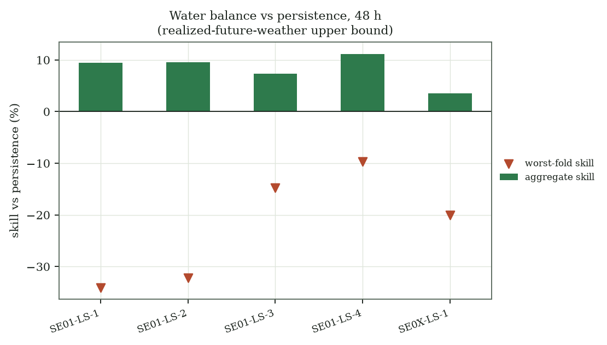
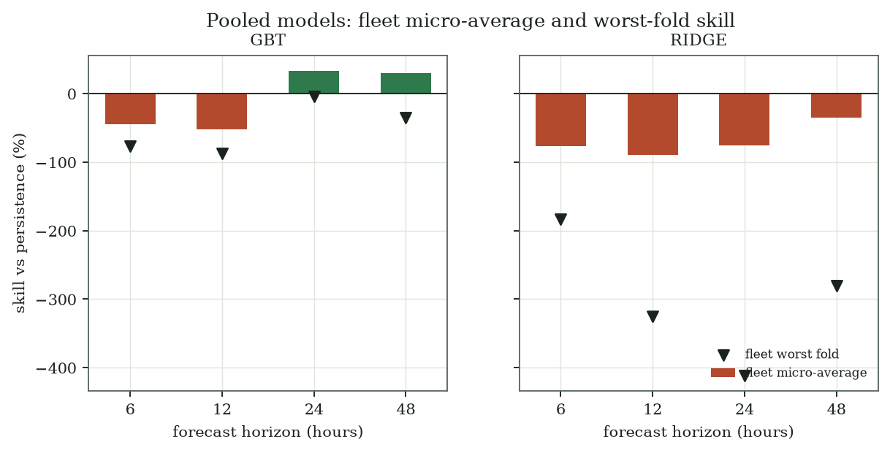

# Interim D5 evaluation report (2026-07-23)

**Deliverable:** D5 evaluation, feeding D2 irrigation · **Date:** 2026-07-23 ·
**Status:** persistence remains the served champion

Every quoted D2 number below is recomputed offline by `scripts/generate_reports.py`. The build
loads the five DVC-pinned soil-probe snapshots and pinned weather snapshot through
`load_soil_probe_frames`, calls `seed_everything`, validates the checked-in YAML configs, and
runs the current `run_experiment` and `run_pooled_experiment` package APIs. It has no dependency
on `mlruns`, a run ID, prose-transcribed metrics, network access, or raster downloads.

Clean-clone reproduction:

```bash
uv sync --extra notebooks --extra sensors
uvx --from 'dvc[s3]' dvc pull data/raw/sensors.dvc data/raw/weather.dvc
uv run python scripts/generate_reports.py
```

## Protocol and interpretation limits

- Configs: `configs/d2_irrigation/water_balance.yaml`, `pooled_gbt.yaml`, and
  `pooled_ridge.yaml`; seed: `42`.
- Evaluation uses five expanding walk-forward folds and purges the final `h-1` training labels
  at each boundary.
- **Oracle-weather limit:** all three challengers use `forecast_features: true`. Their lead-time
  weather comes from realized future weather, not archived forecast vintages. Results are
  perfect-weather upper bounds, not deployable forecast evidence.
- **Micro-average limit:** pooled `ALL` skill is a row-weighted micro-average of correlated
  probe-hours sharing timestamps and weather. It is not five independent replications.
- **Worst-fold limit:** aggregate gains do not satisfy the promotion gate when worst-fold skill
  is negative. Worst-fold results are reported for every computed horizon below.

## Water balance: 48-hour per-probe evidence



| device | n | mae_persistence | mae_water_balance | aggregate_skill | worst_fold | recall_persistence | recall_water_balance |
|---|---|---|---|---|---|---|---|
| SE01-LS-1 | 1335 | 0.523 | 0.474 | +9.4% | -34.1% | 1.000 | 1.000 |
| SE01-LS-2 | 1335 | 0.475 | 0.429 | +9.6% | -32.3% | 0.969 | 0.962 |
| SE01-LS-3 | 1335 | 0.505 | 0.468 | +7.3% | -14.8% | 0.996 | 0.989 |
| SE01-LS-4 | 1335 | 0.342 | 0.303 | +11.2% | -9.7% | 0.912 | 0.908 |
| SE0X-LS-1 | 1335 | 0.293 | 0.283 | +3.5% | -20.1% | 1.000 | 1.000 |

Aggregate 48-hour skill is +3.5% to +11.2% across five probes, but every
probe has a negative worst fold (-34.1% to -9.7%). This is
oracle-weather evidence, so water balance remains an active experiment and is not promoted.
All 6/12/24/48-hour rows are in
[`assets/d5_water_balance_all_horizons.csv`](assets/d5_water_balance_all_horizons.csv).

## Pooled GBT and ridge: fleet evidence



| model | horizon_h | n | fleet_micro_skill | fold_median | worst_fold |
|---|---|---|---|---|---|
| pooled_gbt | 6 | 7005 | -45.1% | -2.4% | -76.6% |
| pooled_gbt | 12 | 6975 | -52.2% | +0.8% | -86.9% |
| pooled_gbt | 24 | 6915 | +33.0% | +10.7% | -4.2% |
| pooled_gbt | 48 | 6795 | +30.2% | +19.9% | -35.5% |
| pooled_ridge | 6 | 6830 | -76.9% | -86.8% | -183.4% |
| pooled_ridge | 12 | 6800 | -89.0% | -156.0% | -325.4% |
| pooled_ridge | 24 | 6740 | -75.5% | -124.7% | -411.2% |
| pooled_ridge | 48 | 6645 | -34.6% | -76.9% | -280.6% |

GBT's fleet micro-average is positive at 24 and 48 hours, but its worst fold is negative at all
four horizons. Ridge's fleet micro-average and worst fold are negative at every horizon.
Different `n` values reflect each estimator's valid-row policy; comparisons to persistence are
made on each model's own scorable rows. The full device-level recomputation is retained in
[`assets/d5_pooled_results.csv`](assets/d5_pooled_results.csv).

## Alert-decision limits

Precision/recall can look excellent when a probe spends most of the holdout on one side of the
irrigation threshold. The report therefore does not treat threshold recall as an independent
promotion result. Positive average MAE skill can also coexist with slightly worse recall, as
shown in the computed 48-hour water-balance rows.

## D3 and D4 scope

The companion [D3 screening report](2026-07-23-d3-screening.md) is generated from its retained
result artifact, not from raster downloads. It has no labels and claims no classification
accuracy.

**D4 harvest timing is not evaluated.** No harvest dates, yield, Brix, pH, TA, or equivalent
ground truth are available in the pinned inputs, so there is no honest D4 backtest to report.

## Decision

Persistence remains the served D2 champion. The oracle-weather challengers do not beat it
robustly under the worst-fold gate, and pooled fleet micro-averages are not independent
confirmations.
