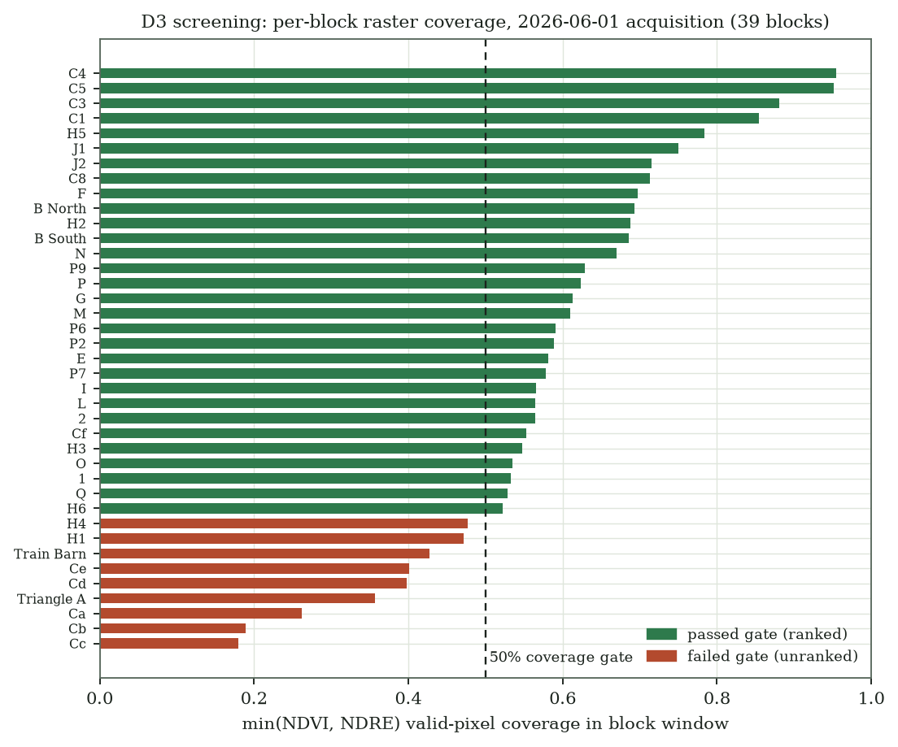
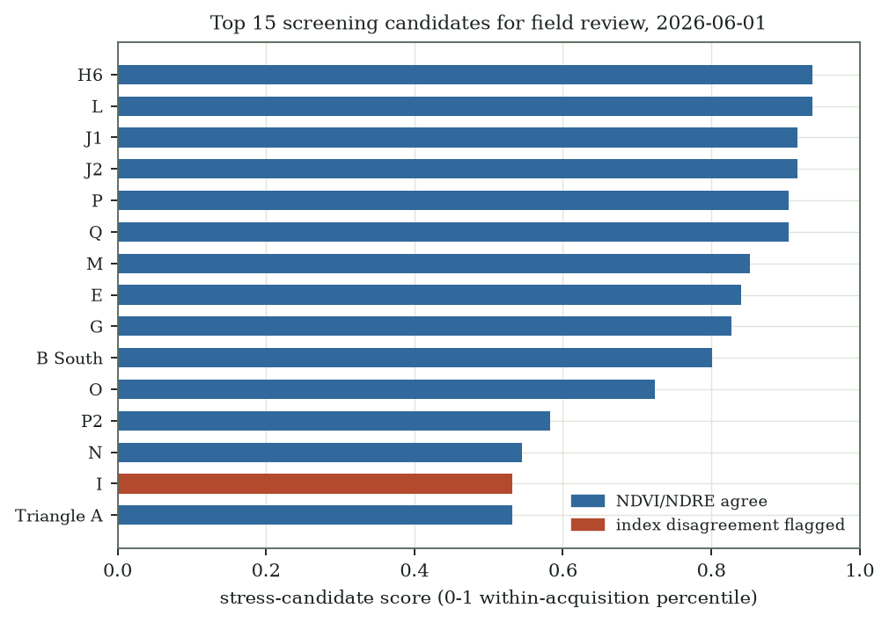

# D3 report: label-free NDVI/NDRE block screening

**Deliverable:** D3 plant-health CV · **Date:** 2026-08-05 · **Status:** current
engineering artifact, not a supervised model

A same-acquisition, label-free ranking of 39 vineyard blocks from NDVI/NDRE
distribution summaries. It has no learned parameters and no ground truth: it orders blocks
for **human field review**, and cannot diagnose stress, disease, or pests.

This report is generated offline by `scripts/generate_reports.py` from
[`assets/d3_screening_result.csv`](assets/d3_screening_result.csv), the retained result
artifact of the corrected 2026-06-01 raster screen. Artifact SHA-256:
`3fa81d63736ef23423b7674f10945cfc8dddbbb0b529eb9051a0e88998e59aad`. The generator does **not** open or download the source rasters.

## What changed since the first run

An adversarial review invalidated the first screen: its coverage denominator counted each
polygon window's *bounding box* rather than the polygon interior, and rejected rows still
influenced accepted-block percentiles. Both are fixed and covered by regression tests
(`tests/d1_pipeline/test_geo.py`, `tests/d3_vision/test_stress.py`). This page is the rerun
against the real rasters with the corrected implementation; the superseded numbers (a 30/9
coverage split) are in git history and are not evidence.

The per-block distributions themselves did not move — identical pixel counts and quantiles —
because only the quality denominator was wrong. What changed is which blocks pass the gate.

## Reproduction

- The two source rasters are ~4 GB each. They were fetched once to
  `data/raw/imagery/rasters/` and screened locally; range-reading them over the public
  share proved unreliable across multi-hour runs.
- The screening configuration is `configs/d3_vision/stress_screening.yaml` (remote
  `/vsicurl` paths; point `ndvi_raster`/`ndre_raster` at local copies to reproduce).
- The tables and figures below are regenerated deterministically from the retained artifact.

## Coverage gate

39 of 39 blocks passed the quality gate (0 failed). Coverage is
the fraction of **polygon-interior** pixels that are valid after nodata handling; the
2026-06-01 whole-vineyard mosaic covers every block interior completely.

## Screening candidates

The highest-concern blocks are H6, L, J1, J2. This is a review queue, not a diagnosis.
11 of 39 ranked blocks carry the NDVI/NDRE rank-disagreement
flag, meaning the two indices disagree about the block's relative standing by more than the
configured margin — inspect those with extra care.

| block_id | rank | score | ndvi_coverage | ndre_coverage | ndvi_q50 | ndre_q50 | disagreement_flag |
|---|---|---|---|---|---|---|---|
| H6 | 1 | 0.936 | 1.000 | 1.000 | 0.328 | 0.127 | False |
| L | 1 | 0.936 | 1.000 | 1.000 | 0.363 | 0.106 | False |
| J1 | 3 | 0.917 | 1.000 | 1.000 | 0.365 | 0.111 | False |
| J2 | 3 | 0.917 | 1.000 | 1.000 | 0.365 | 0.100 | False |
| P | 5 | 0.904 | 1.000 | 1.000 | 0.361 | 0.129 | False |
| Q | 5 | 0.904 | 1.000 | 1.000 | 0.327 | 0.148 | False |
| M | 7 | 0.853 | 1.000 | 1.000 | 0.355 | 0.147 | False |
| E | 8 | 0.840 | 1.000 | 1.000 | 0.415 | 0.124 | False |
| G | 9 | 0.827 | 1.000 | 1.000 | 0.452 | 0.118 | False |
| B South | 10 | 0.801 | 1.000 | 1.000 | 0.426 | 0.140 | False |

The complete ranked output is
[`assets/d3_full_ranked.csv`](assets/d3_full_ranked.csv).

## Excluded blocks

No block was excluded. Every polygon interior is fully covered by valid pixels in both rasters, so the gate rejected nothing on this acquisition.

## Limits

- **This is a screening order, not a label.** Low indices can reflect phenology, background
  soil, shadows, pruning, irrigation, or processing artifacts.
- Scores are within-acquisition percentiles for 2026-06-01 and should not be compared with
  another date without matched footprints and seasonal controls.
- Thresholds and weights are screening choices, not vineyard-validated decision boundaries.
- No labeled stress/pest imagery exists, so no supervised accuracy is reported. Supervised
  D3 classification stays blocked on mentor-provided labels.
- **D4 harvest timing is not evaluated here.** This artifact has no harvest-readiness, yield,
  or maturity ground truth.

## Next step

Field-verify a sample of the top-ranked blocks with the vineyard team. Agreement between this
order and what reviewers actually find is the only way to learn whether the screen is useful,
and it is the shortest path to the labels supervised D3 needs.
